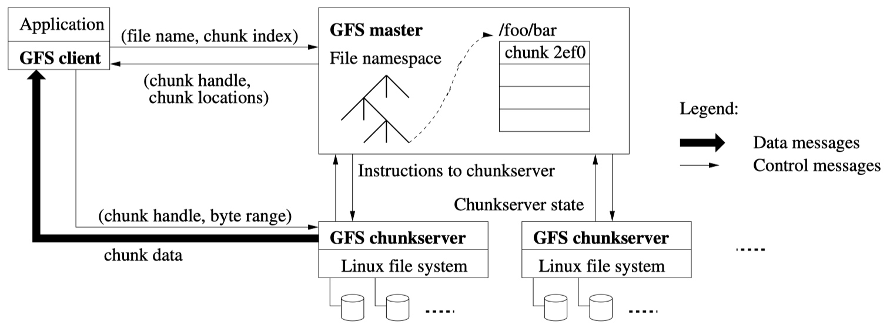
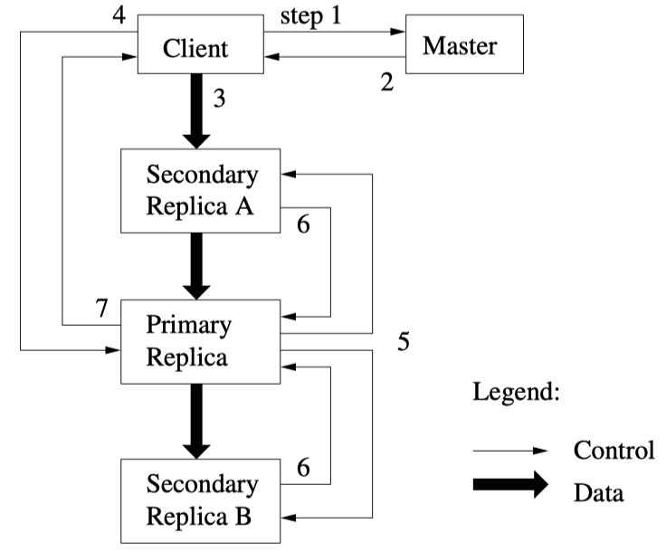

# Readings - The Google File System论文
## 介绍
GFS是由Google设计和实现的，以满足Google对数据处理快速正常的需求。GFS和先前的分布式文件系统有很多相似的目标，例如：性能、可扩展性、可靠性和可用性。然而，GFS的设计是由Google对应用负载和技术环境的关键（当前和预期的）观察驱动的，这反映了与早期文件系统设计假设的显著不同。Google重新审视传统的选择，并探索在设计领域探索了彻底不同的观点。
* 组件故障是常态而非例外。
    因此持续的监控、错误监测、容错和自动恢复是系统不可缺少的。
* 传统标准的文件是巨大的，常常很多GB。处理包含数十亿个对象、很多TB、且快速增长的数据集时，即便文件系统可以支持，也很难管理数十亿个约KB大小的文件。
    因此设计假设和参数，例如IO操作和block大小必须被重新审视。
* 大多数文件修改都是通过追加新数据的方式，而非覆盖已有的数据。对文件的随机写几乎已经不存在了。一旦写入，文件就是只读的，且常常只是顺序读。
  鉴于这样对大文件的访问模式，追加成为了性能优化和原子保证的的关注点，而在client上对数据块的缓存失去了吸引力。
* 应用程序和文件系统api的协同设计，通过提升灵活性，有益于整个系统。

## 设计概览
### 接口
虽然GFS没有实现例如POSIX的标准API，但也提供了一组熟悉的文件系统接口。文件以层次结构的方式用目录组织起来，并用路径名来标识。GFS支持*create，delete，open，close，read*和*write*文件。GFS还支持*snapshot*和*record append*。

### 架构
一个GFS集群由一个*master*和多个*chunkserver*构成，可以被多个*client*访问。

文件被切分为固定大小的*chunks*。每个chunk都由一个不可变，且全局唯一的64位*chunk handle*标识，这个chunk handle在创建chunk时master分配的。chunkservers把chunk作为linux文件存储在本地磁盘上，并通过指定的chunk handle和byte range来读写文件。为了reliability（可靠性），每个chunk会在多个chunkservers上有复制。

master维护这整个文件系统的metadata，包括namespace，访问控制信息，文件到chunk的映射，以及chucks的当前位置。master还可控制着系统级别的活动，例如chuck租约管理，孤儿chunk的垃圾回收，以及chunkservers之间的chunk迁移。master定期与每个chunkserver以HeartBeat消息的形式进行通信，完成指令的发送和状态的收集。

client与master通信来进行metadata相关的操作，数据相关的通信是直接与chunkserver进行的。

client和chunkserver都不需要缓存数据。client缓存数据的收益很小，因为大多数程序都是流式读取大文件或者数据量太大而无法缓存。client不用缓存数据消除了缓存一致性的问题，简化了系统设计。但client会缓存metadata。chunkserver不必缓存文件数据，因为chunk都是以本地文件的形式保存的，linux buffer cache会把常访问的数据放入内存。

### 单一master
单一master极大的简化了设计，并使master能够使用全局信息来进行复杂的chunk布局和复制决策。然而当读写时，必须最小化master的参与，这样master才不会成为瓶颈。client进行读写时，先询问master应该连接哪个chunkserver，并缓存这个信息一段时间，然后直接与这个chunkserver交互来完成后续的操作。

### chunk size
chunk size是关键设计参数之一。GFS使用一个远大于典型文件系统的block size，64MB。每个chunk副本都以普通linux文件的形式存储在chunkserver，并在需要的时候扩展。惰性空间分配避免了由于内部碎片导致的空间浪费。

大型chunk size有这些优势，
* 减少了client与master交互的需求。
    读写同一个chunk只需要向master请求一次chunk的位置信息。
* 由于chunk较大，client也较为可能在一个给定的chunk上进行很多的操作。
    通过在较长时间内保持与chunkserver的TCP连接，可以减少网络开销。
* 减少了存储在master上metadata的大小。
    由此可以将metadata放入内存。

然而大型chunk size，即便有惰性空间分配，也存在弊端，
* chunkserver的热点访问。
    一个小文件仅有为数不多的chunks组成，可能就一个。如果大量的client都访问同一个文件，那么存储这些chunk的chunkserver可能会成为热点。

### Metadata
mater主要存储3类metadata：
* 文件和chunk namespace
* 文件到chunks的映射关系
* 每个chunk副本的位置

所有的metadata都是存储在内存中的。
* 前两种也会进行持久化存储，这是通过把记录修改到操作日志、在master落盘、以及在远程机器上存放副本来实现的。
* 对于最后一种metadata，master并不会做持久化存储。在master启动和有chunkserver加入集群的时候，master会询问每一个chunkserver存放的chunks。

#### In-Memory Data Structures
由于metadata是存放在内存中的，因此mater的操作很快，除此之外还能完成定期在后台较快的完整扫描。这个定期扫描用于实现chunk的gc，chunkserver故障时副本重新复制，以及chunk的迁移。

一个潜在的问题是存储的chunk数目受限于内存的大小。但由于每个chunk的metadata少于64byte，且文件的namespace数据也少于64byte，并且启用了前缀压缩，因此这不是一个严重的问题。如果确实有必要支持更大的文件系统，加内存即可。

#### Chunk Locations
master并不对chunk locations做持久化。master启动时，会向所有chunkserver请求。之后，由于master控制着所有chunks的放置，并通过心跳消息来监控chunkserver，master能够确保自身的信息是最新的。

为什么不做持久化？
1. 消除了master和chunkserver的同步问题。
    chunkserver可能加入、离开、重启、重命名、故障等。
2. chunkserver对自己有和没有哪些chunk有最终的话语权。
    在master维护此信息的一致视图是没有意义的，chunkser可能出现1中的各种问题。
    
#### Operation Log
操作日志对GFS很重要，
* 包含了metadata关键修改的历史记录，并持久化。
* 作为逻辑时间戳，定义了并发操作的顺序。
    文件和chunks，以及它们的版本，全都在创建的时候被逻辑时间唯一且永久的标识。
    
可靠性保证，
* 仅当metadata的修改完成持久化以后，这些修改才对client可见。
* 在多个远程机器上有复制。
    * 仅当把相应的log记录写入本地和远程机器的磁盘后，才响应client。
    * master会批量flush日志，来减少flush和复制对整个集群吞吐量的影响。
* master通过重放操作日志来恢复文件系统的状态。
    * 为了减少启动的时间，需要保证log较小。
    * 当log增长超过特定大小时，master会checkpoint自身的状态，以便可以在恢复时载入最后一个checkpoint并重放在那之后的log。

checkpoint和恢复，
* checkpoint类似于压缩后的B树，可以直接map到内存，并用用户namespace的查找，且不需要额外的解析。
* master创建checkpoint时，会切换到新log文件，并在另外的线程中创建checkpoint（包含了checkpoint前的所有修改），避免延误当前的修改。
* 恢复只需要最近的一个*完整*（需要检测是否完整）checkpoint和后续的log文件。更老的checkpoint和log是可以释放的。

### 一致性模型
GFS有一个宽松的一致性模型，这在支持高度分布式应用的同时，也相对简单和高效。

#### Guarantees by GFS
文件namespace修改（例如：创建文件）是原子的，由master专门执行。namespace锁保证了原子性和正确性；master的操作日志定义了这些操作的全局顺序。

一个文件区域有两种状态，
1. consistent：无论client从哪个副本读取，都能看到相同的数据。
2. defined：在文件数据修改后，如果文件区域是consistent的，并且client能看到所有写入到文件的修改。

数据修改包含，
1. 写入
    * 写入操作会把数据写到应用程序指定的文件offset。
2. 追加
    * 即使在并发修改存在的情况下，追加会把数据在GFS选择的offset处*至少一次原子*追加一次。
    * 这个offset会返回给client，标记了一个defined文件区域的起始位置，这个区域包含了已追加记录。
    * GFS可能会插入填充或重复记录项。他们占据的区域被认为是inconsistent，且占用户数据总量的很小一部分。

|  | Write | Record Append |
| --- | --- | --- |
| Serial success | defined（同时也是consistent） | defined interspersed with inconsistent  |
| Concurrent success | consistent but undefined 1. 所有client都能看到相同的数据。 2. 但是这些数据并不能反映任何修改所写入的内容。 3. 这些数据一般包含混合了多个修改的片段。 | defined interspersed with inconsistent |
| Failure | inconsistent（同时也是undefined） | inconsistent |

如何区分defined和undefined的文件区域？

*在一些列的成功修改后，被修改的文件区域保证是defined*（？），且包含了最后一次修改所写入的数据。GFS通过以下方式来实现这个保证，
1. 在所有的副本上以相同的顺序对chunk进行修改。
2. 用chunk版本号来检测过期的副本（由于chunkserver下线导致缺失修改）。
    过期的副本不会参与到修改或返回给client，会尽早的被gc掉。

> 不过这里我存疑，例如：concurrent write，并不能保证defined。

某些client会cache chunk的位置。由于cache的timeout，读取到过期数据的时间窗是有限的。另外，对于大多数文件都是追加操作，一个过期的副本通常会返回过早结束的文件块，而非过期的数据。

在修改完成很长时间后，机器故障也会破坏或摧毁数据。GFS通过master和chunkserver定期的握手来检测失效的chunkserver，并通过校验和来检查数据损坏。当问题出现时，数据会尽快的从有效的副本进行恢复。如果在GFS来不及反应（没有足够的处理时间）的时候，所有的副本都丢失了，那应用能收到错误，而不是看到损坏的数据。

#### Implications for Applications
GFS应用可以通过一些已经用于其他目的的简单技术来适应宽松一致性模型，
* 依赖追加而非覆盖，以及checkpointing
    * 例如：writer从头生成一个文件，待所有数据写入完毕以后，原子的把文件进行重命名。也可以定期创建checkpoints记录成功写入了多少。checkpoints也可以包含应用级别的校验和。readers只检查和处理至最后一个checkpoint之间的文件区域，这些文件区域是defined。
    * 追加远比随机写要高效和有弹性的多。
    * checkpoint允许writer以增量的方式重新写入，并避免reader处理那些从应用的角度看仍是不完整的数据，尽管这些数据已被成功写入。
* 写入时自我校验和自我识别的记录
    * 记录是以至少追加一次的语义来记录每个writer的输出的，因而reader需要处理偶然的填充和重复的情况。
    * writer写入的每个记录都包含额外的信息，例如校验和，用于验证。reader用校验和来识别并丢弃填充数据，以及记录片段。
    * 如果无法容忍偶然出现的重复（例如，这些数据会触发非幂等的操作），那可以通过记录中的唯一标识来进行过滤。

> keeps readers from processing successfully written file data that is still incomplete from the application’s perspective.
> 我没有完全理解所谓的从应用的角度看仍是不完整的数据，是指的最后一个checkpoint之后的那些数据？

## 系统交互
GFS的设计可以最大限度的减少master参与到所有的操作。

### 租约和修改顺序
文件的修改发生在chunk的所有副本上，GFS使用租约来维护副本之间一致的修改顺序。master会将一个chunk的租借给其中一个副本，这个部分叫做主副本。主副本选择对chunk所有修改的序列顺序，所有的副本在应用这些修改的时候都会遵循这个顺序。最后，全局的修改顺序，首先由master选择的租借授权顺序定义（先选择某个副本为primary，然后可能又选择了另一个为primary），并在租期内由主副本分配的序列号定义。

租约机制的好处是最小化master的管理开销。
* 租约起始的timeout是60s，但只要chunk还在被修改，主副本可以无限次的请求，然后（一般情况下）得到timeout的扩展。
* timeout扩展的请求的授权是存放在master和所有chunkservers定期交互的心跳包里面的。
* master可能会在租约过期前撤销（例如master要禁止一个正在rename的文件的修改）。
* 即使master丢失了与primary的通信，master也可以在老的租约过期后，将新的租约授权给另一个副本。

下面以写入为例说明整个过程，
1. client向master请求持有租约的chunkserver以及其他副本的位置。如果租约未被持有，master会授权一个副本。
2. master返回给client primary的标识和其他副本的位置。client cache这些数据，且仅在无法连接到primary或primary不在持有租约的时候才会联系master。
3. client将数据推送到所有副本，任何顺序均可。每个chunkserver会将这些数据存储在内部的LRU缓存中，直至数据被使用或过期。
4. 一旦所有副本确认收到数据以后，client向primary发送写请求。写请求标识了先前推送到所有副本的数据。
    * primary为所有收到的修改（可能来自多个client）分配连续的序列号，序列号提供了必要的序列化（necessary serialization）。
    * primary将修改以序列号顺序应用到本地状态。
5. primary向所有从副本转发写请求。每个从副本都以primary分配的相同序列号顺序应用修改。
6. 所有从副本回复primary，表明已完成操作。
7. primary回复client。

如果上述过程出错，
* 任何副本发生错误，都会汇报给client。
* 如果在primary发生错误，序列号将不会被分配和转发。
* client的请求被认为已失败，被修改的文件区域将处于不一致状态。
* client会做重试，在完全从头重试写入之前，会重试步骤3~7。

如果一个写入的数据很大或跨越了chunk的边界，GFS client会把数据打散成多个写操作。这些写操作遵循了上述流程，但是可能会与其他client的并发写操作交替和被覆盖。因此文件区域将会出现consistent but undefined的情况。

### 数据流
从控制流解耦数据流是为了高效的使用网络，
1. 最大化利用每个机器的网络带宽
    * 数据以流水线的方式，沿着精心挑选的chunkservers链进行线性的推送，而非以其他拓扑形式来推送（例如：树）。
    * 这样每个机器的所有出口带宽都会用书尽可能快的传输数据，而非将带宽拆分到多个接收者。
2. 避免网络瓶颈和高延迟的链路
    * 交换机链路通常有这两个问题。
    * 每个机器会把数据转发到网络拓扑中最近（通过ip地址来估算）的且未收到数据的机器。
3. 最小化推送所有数据的延迟
    * 通过在TCP连接上流水线数据传输来实现
    * 

# Lectures

# Lab
* Lecture 3没有关于GFS的实验，不过我找到了[ppca-gfs](https://bitbucket.org/abcdabcd987/ppca-gfs/src/master/)，看介绍是上交ACM班一个课程的作业，就用这个来补上GFS的实验吧。
* lab的代码在[github.com/chaomai/mit-6.824](https://github.com/chaomai/mit-6.824/tree/master/src/gfs)
