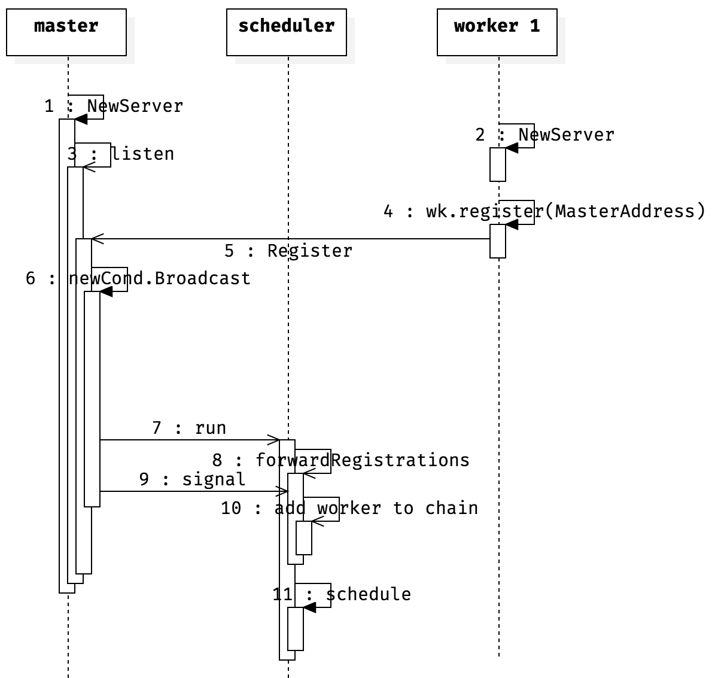

# 6.824 - Spring 2017 Lecture 2 Infrastructure - RPC and threads
# Lectures
## Remote Procedure Call (RPC)
分布式系统的关键组件。

目标：简化C/S通信的开发。

* 隐藏 C/S 通信的大多数细节。
* client 端进行 RPC 调用，就像调用普通的函数一样。
* server 端处理 RPC 请求，就像处理普通的函数一样。

RPC消息发送图示，

```
  Client             Server
    request--->
       <---response
```

软件结构，

```
  client app         handlers
    stubs           dispatcher
   RPC lib           RPC lib
     net  ------------ net
```

## 一些细节
* 组织数据：把数据封装为数据包。
* Binding：client 如何知道应该向谁发送请求？
    * 要么在 client 提供 server 的 host name。
    * 要么有一个 name service，提供 service names -> best server host 的map。

## RPC错误处理
可能存在的错误，
* lost packet
* broken network
* slow server
* crashed server

client 观察到的错误可能有，
* client 无法接收到 server 的 response。
* client 无法得知 server 是否接受到了 request。
    * server根本就没有收到请求。
    * server执行调用了，但在发送响应前，server出错了。
    * server执行调用了，但是发送响应的时候，网络出问题了。

## RPC语义
### at least once（best effort）
client 等待 server 的 response，没有响应 -> 重新发送请求，尝试多次仍然没有 response，返回 error。
重新发送请求可能导致 server 重复执行操作。如果重复执行操作是不可接受的，那相关接口必须是幂等的。

### at most once
由server 检测重复的请求，返回重复请求先前的 reply，而非重复执行。

如何检测：client 的每个请求包含一个唯一的 ID，

```
server:
if seen[xid]:
  r = old[xid]
else
  r = handler()
  old[xid] = r
  seen[xid] = true
```

at most once的难点，
* 如何保证 ID 唯一？尤其是分布式多个 client 的情况下。
    * 大随机数？
    * 唯一的 client ID + request seq id？
* server 最终是需要丢弃老的 request 的结果的。何时丢弃是安全的？
    * 类似TCP sequence #s 和 acks 的方法。使用唯一的 client ID；每个 client 的 RPC 有一个 seq id；对于每个 RPC，client 包含了 seen all replies <= X。
    * 只允许 client 有一个未完成的 RPC。对于 seq + 1 的 request，server 可以丢弃所有 <= seq。
* 当上一个 request 还在运行的时候，如何处理重复的 request？
    * 此时 server 还无法查到 reply，但又不想重复执行。可以为每个正在执行的 RPC 加上 pending 标签，重复的 RPC 进行等待/忽略。
* 如果 server 挂了或重启怎么办？
    * 如果有 memory 中的数据备份，那么 server 可以在重启后忽略并接受重复的请求。
    * 数据冗余是否应该写入磁盘？
    * 备份 server 是否也应该有这些数据的备份？

### exactly once
at most once + 无限重试 + 容错服务。

# Lab 1: MapReduce
这次的实验仍然继续 Lab 1: MapReduce。完成单机版的 MapReduce 以后，还要实现分布式的 MapReduce（模拟），这里需要 RPC 库。

Go RPC 都提供了 at most once 的语义，换句话说，并不保证送达。如果 worker 没有响应，但实际上是在执行 task 的，那么 master 会重新调度新的 worker 来执行这个任务。

Lab 1: MapReduce 给出的代码已经提供了框架，下面分析了原始代码中，master 初始化，以及注册 worker 的过程，


