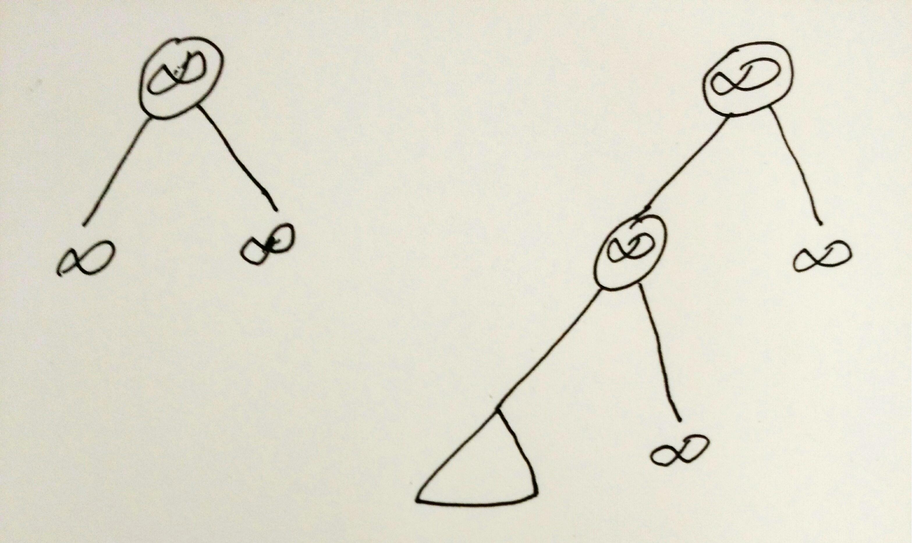
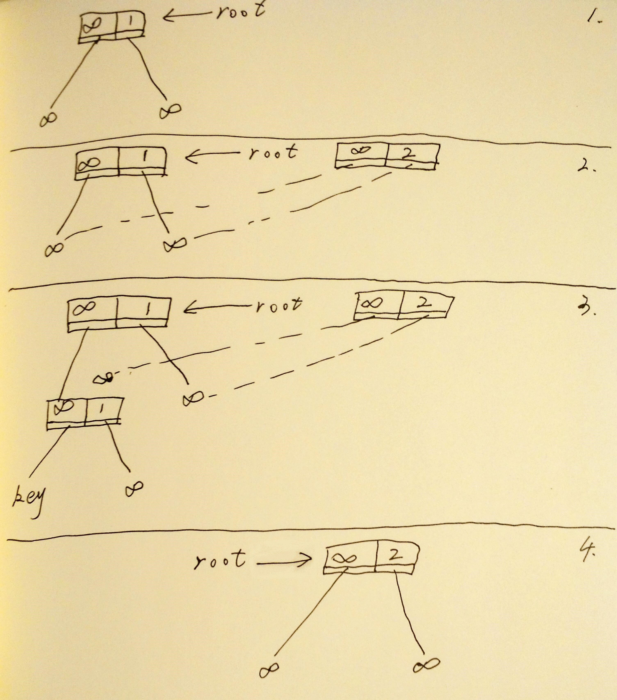

title: CKDTree (1)
date: 2015-11-20 15:55:08
description: Concurrent KDTree with Snapshots, implemented in Java. This article is about some details in implementation.
categories:
    - concurrency
tags:
    - ckdtree
    - snapshot
---

Concurrent KDTree with Snapshots, implemented in Java. This article is about some details in implementation.

# Basic Idea

The methods used in this structure is heavily based on ideas in CTrie (snapshot) and Non-blocking Binary Search Trees (search, insert and delete).

* RDCSS
* GCAS
* Mark and Flag
* Leaf-oriented tree

# Problems and Solutions in Implementation

下面是实现的时候遇到的问题和自己对一些细节的思考，有的已经在两篇论文里面有所记录，但是自己没注意，又踩坑了，还有的是这个结构的设计隐含的问题。

## Dummy Nodes

由于Non-blocking Binary Search Trees中的insert操作是需要mark parent的，因此，对于一棵空的tree（有一个root），parent并不存在，insert无法适用于这样的情况。delete也有类似的问题。

为了避免结点数目很少的时候需要考虑很多复杂的情况，Non-blocking Binary Search Trees里提到了使用两个key为$\infty_1$，$\infty_2$（其中$\infty_1 < \infty_2$）的Dummy nodes，$\infty_1 < \infty_2$这样的关系是为了保证Binary Search Trees的性质。

由于Java中，无法使用`Double.POSITIVE_INFINITY`来得到两个key，使得$\infty_1 < \infty_2$，所以就干脆不管他们的关系，root的左右child都使用`Double.POSITIVE_INFINITY`作为key。



这样一来，
1. 只有在insert第一个key或者delete最后一个key的时候需要操作leaf dummy node。
2. 除（1）以外，所有update都发生在上图三角形的sub tree里面。

## Right Child of Root

既然没有key会进入root的right child，那么为什么不把root的right child设置为`null`。

不行，这个也是在写后续代码的时候发现的。进行`helpMark1`和`helpMark2`的时候，需要判断`GCAS`处理grand parent哪边的child，

```java
if (info.p == info.gp.GCAS_READ_LEFT_CHILD(this)) {
  direction = Direction.LEFT;
} else {
  direction = Direction.RIGHT;
}
```

如果要delete的leaf是children of the left child of root，也就是说此时tree里面只有一个key。存在这么一种可能性，同时有多个thread来进行delete，其中一个thread已经成功进行了delete，其他某些的thread还没有执行上述代码。当开始执行以后，就会发现`p`不等于`gp`（即root）的left child，此时如果root的right为`null`，那么就会出错。

`helpMark1`和`helpMark2`都包含上述操作，只是仅仅`helpMark1`才会触发问题。

## Type Test in `helpMarked1`

当要delete的leaf，它的sibling是leaf时，`helpMarked1`来处理这种的情况。

在single thread的情况下，`helpDelete`在判断sibling的类型以后，如果是leaf，那么`helpMarked1`就会执行。

在multithread的情况下，某个thread看到update信息以后就直接执行`helpMarked1`，但是此时sibling的类型是不知道的。因为从update信息被发布，到`helpMarked1`被执行，sibling可能早就被其他thread改变了，如果变为internal node，

```java
Leaf<V> ns = new Leaf<>(sibling.key, ((Leaf<V>) sibling).value);
```

那么上述代码就会报错。


## Mark in `helpDelete`

Non-blocking Binary Search Trees提到marked的结点是不可更改的，实现的时候没有很在意，测试的时候就遇到了麻烦。

`helpDelete`（1）首先mark parent，（2）read leaf的sibling，（3）根据sibling的类型来进行后续的操作。

（1）和（2）的顺序是不能改的，这也是mark的意义所在。mark以后，`helpMarked1`和`helpMarked2`中还会再次读取sibling，并用于构造新的node，然后`GCAS` grand parent的child。如果不能保证`helpDelete`中leaf的sibling在后续的操作中不变，那么构造出的新node很可能就是错的。

## `startGen` in `searchKey`

这个结构使用了Ctrie里GCAS的idea，在search的时候来update从root到leaf的path。search使用的version number是在开始进行search前从root里read的。为什么不到每个node的时候就read一次version number？

因为如果在search到某个内部的结点的时候，执行了snapshot操作，那么root的version number就变了。此时search中read root的version number，就会造成path的错误更新，上半部分是老的version number，下面有一条新的version number的分支。

## Retry after `GCAS` in `searchKey`

`searchKey`中，如果发现要前往的branch是internal node，并且version低于`startGen`，那么就需要创建那个internal node新版本的copy，然后把cur node的branch设置为那个新版的node。

接下来，首先想到的是在cur node处重试（即下面代码里的`continue;`），但是如果`continue`了，那么`gp`，`gpupdate`和`depth`就会被“提前”更新（cur没有往下走，它们却被更新了），尤其是`depth`，可能被重复的加上了`p`的`skippedDepth`。

```java
while (cur instanceof InternalNode) {
  gp = p;
  gpupdate = pupdate;
  ...
  depth += p.skippedDepth;

  if (keyCompare(key, cur.key, depth++) < 0) {
    ...
    if (left instanceof InternalNode) {
      if (left.gen != startGen) {
        ...
        return SearchRes.RESTART;
        // continue;
    ...
```

效率低些，但是更为稳妥的办法就是完全重新开始，`return SearchRes.RESTART;`。

## RDCSS




## `size` in Snapshot

未解决。

## Readonly Iterator

# References

1. Concurrent Tries with Efficient Non-Blocking Snapshots, Aleksandar Prokopec, Nathan G. Bronson, Phil Bagwell, Martin Odersky
2. Non-blocking Binary Search Trees, Faith Ellen, Panagiota Fatourou, Eric Ruppert, Franck van Breugel
3. A Practical Multi-Word Compare-and-Swap Operation, Timothy L. Harris, Keir Fraser, Ian A. Pratt
