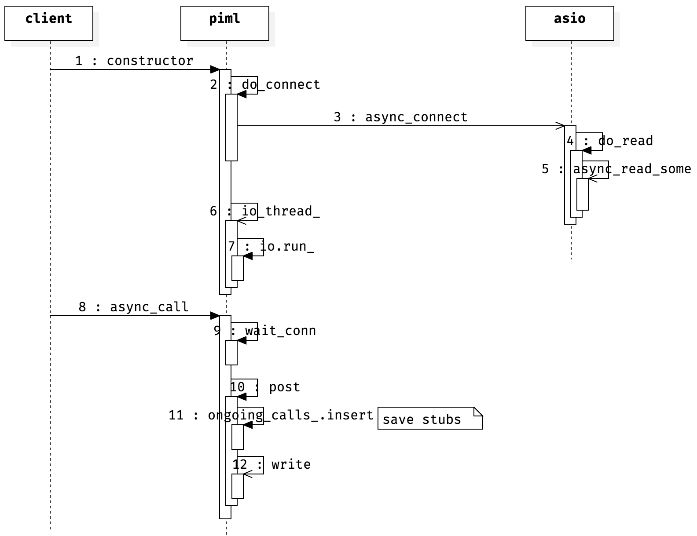
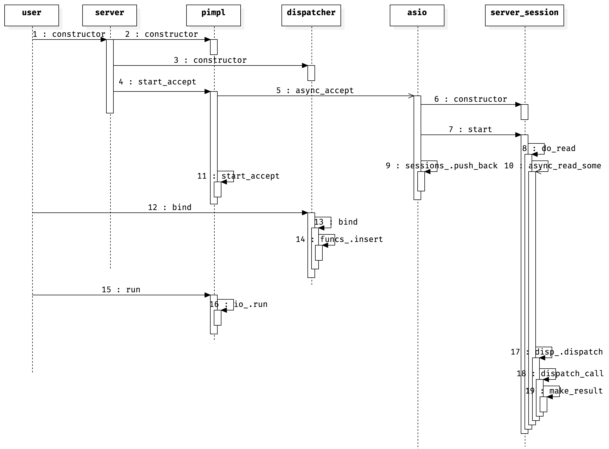

title: rpclib
date: 2017-04-28 13:54:34
categories:
    - c++
---

# rpclib

[rpclib](https://github.com/rpclib/rpclib) 是一个使用 C++14 实现的 RPC 库，提供了 server 和 client 端的实现。

# 实现细节

## 组织数据

在 server 端注册函数，client 调用时，使用 msgpack 将 `static_cast<uint8_t>(client::request_type::call), idx, func_name, args_obj` 封装为 `RPCLIB_MSGPACK::sbuffer`， 并记录该函数的 `idx, func_name, p`，供 server 返回数据时查询和 set 结果。

## client 如何知道应该向谁发送请求

client 提供 server 的 host name。

## 错误处理

RPC需要网络传递数据，可能由于网络或 server 原因导致多种错误。rpclib 使用了 [asio](https://github.com/chriskohlhoff/asio)，代码本身并未涉及由于网络导致的错误。rpclib 的 server 端主要处理了由于函数执行抛出的 `std::exceptions`。函数执行时抛出的异常可选择是否忽略，当不忽略时，server 会将异常返回给 clinet。

# client

# server

* `dispatcher`：管理注册的函数，通过函数名查询和执行注册的函数
* server loop：由 `io_.run` 启动，server 的所有工作都是在这个loop里面完成的。当需要多个 worker 时，`pimpl` 的 `io_.run` 在多个 thread 中运行即可。

