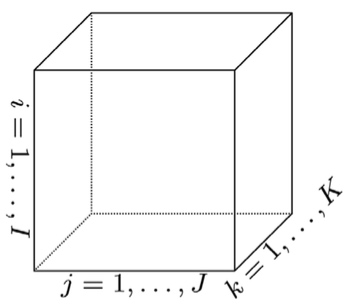
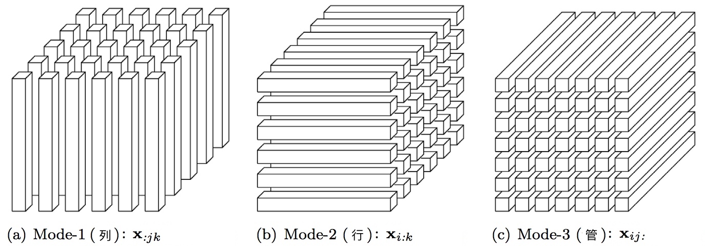
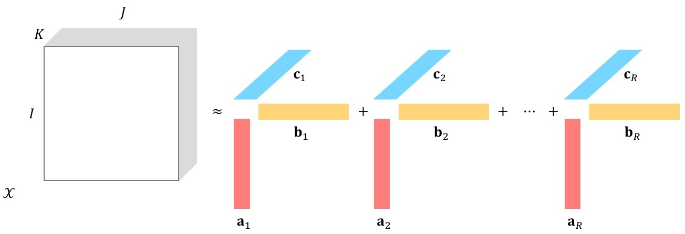
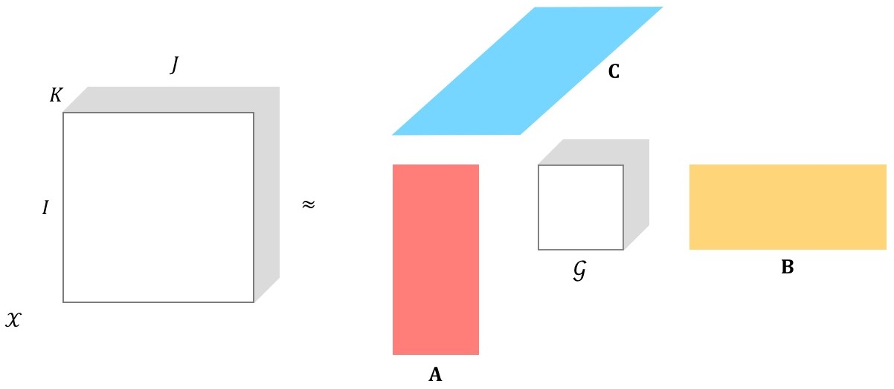

title: Tensor相关
date: 2017-02-04 13:54:34
categories:
    - tensor
---

# 1. 行列式

### 1.1 定义

有[三种定义方式](https://www.zhihu.com/question/26294660/answer/32525286)，

* 排列和逆序数
* 用代数余子式和按行展开来递归定义
* 用归一化、多线性、反对称来定义
    1. 归一化（单位矩阵行列式为1）、多线性（当矩阵的某一列所有元素都扩大c倍时，相应行列式也扩大c倍。多的意思是对所有n个列都呈现线性性质）、反对称（交换两列行列式反号）
    2. 行列式等于它的各个列对应的向量张成的平行2n面体的体积，这是因为行列式是一个交替多重线性形式，而我们通常理解的欧式空间中的体积也是这样一个函数（单位立方体体积为1，沿某条边扩大c倍体积就扩大c倍，交换两条边以后体积反号——这一条是补充定义的，我们认为体积是有向体积，其数值表示体积大小，正负号表示各条边的排列顺序或坐标轴手性），而满足归一性、多线性、反对称性的函数是唯一的，所以行列式的直观理解就是欧式空间中的有向体积

### 1.2 矩阵角度的几何意义

$2 \times 2$矩阵的行列式定义如下：

$$
\det(A)=
\begin{vmatrix}
a & b \\
c & d \\
\end{vmatrix}=
ad-bc
$$

矩阵的两个行向量构成了一个平行四边形，$ad-bc$的绝对值是这个平行四边形的面积。$3 \times 3$矩阵的行列式的值是这个三个行向量构成的平行四面体的体积的绝对值，同理可扩展到n阶矩阵的行列式。

对于一个$n \times n$的行列式，如果其中的一个行向量位于剩下的行向量构成的超平面上，即线性相关，那么$\det(A)=0$。

### 1.3 线性变换角度的几何意义

矩阵对应的线性变换对空间的拉伸程度的度量，或者说物体经过变换前后的**体积比**。

如果矩阵不是满秩的，那么在线性变换后，一个$n$维的空间被“压到了”$k$维，或者说被*压扁了*，原来空间中的体积在变换后体积为0。

# 2. 矩阵

## 2.1 矩阵与线性变换

$$
\begin{cases}
y_1 = a_{11} x_1 + a_{12} x_2 + \cdots + a_{1n} x_n, \\
y_2 = a_{21} x_1 + a_{22} x_2 + \cdots + a_{2n} x_n, \\
\cdots \\
y_m = a_{m1} x_1 + a_{m2} x_2 + \cdots + a_{mn} x_n, \\
\end{cases}
$$

上述方程组，表示从变量$x_1, x_2, \cdots, x_n$到变量$y_1, y_2, \cdots,  y_m$的线性变换，其中系数$a_{ij}$构成一个矩阵。

给定了一个线性变换，它的系数构成的矩阵也就确定，反之，如果给出了一个矩阵，则线性变换也就确定，两者之间存在一一对应的关系。

证明如下（取自[Proving any linear transformation can be represented as a matrix](http://math.stackexchange.com/questions/916192/proving-any-linear-transformation-can-be-represented-as-a-matrix)）：
Consider a matrix $\mathbf x \in \mathbb R^n$ given by
$$
\begin{align*} \mathbf x &= \begin{bmatrix} x_1 \\ x_2 \\ \vdots \\ x_n \end{bmatrix}. \end{align*}
$$
We will construct a matrix $A \in \mathbb R^{n \times n}$ such that $T(\mathbf x) = A \mathbf x$.

The vector $\mathbf x$ can also be written as
$$
\begin{align*} \mathbf x &= x_1 \begin{bmatrix} 1 \\ 0 \\ \vdots \\ 0 \end{bmatrix} + x_2 \begin{bmatrix} 0 \\ 1 \\ \vdots \\ 0 \end{bmatrix} + \dotsb + x_n \begin{bmatrix} 0 \\ 0 \\ \vdots \\ 1 \end{bmatrix} \\ &= x_1 \mathbf{e}_{1} + x_2 \mathbf{e}_{2} + \dotsb + x_n \mathbf{e}_{n} \\ &= \sum_{i=1}^{n} x_i \mathbf{e}_{i}, \end{align*}
$$
where $\mathbf{e}_{i}$ are the standard basis vectors in $\mathbb R^n$.

Consider the transformation $T(\mathbf x)$. Rewriting $\mathbf x$ as above, we have
$$
\begin{align} T(\mathbf x) &= T \left( \sum_{i=1}^{n} x_i \mathbf{e}_{i} \right) \\ &= \sum_{i=1}^{n} T(x_i \mathbf{e}_{i}) \\
T(\mathbf x) &= \sum_{i=1}^{n} x_i T(\mathbf{e}_{i}). \tag{1} \end{align}
$$

Let the matrix $A \in \mathbb R^{n \times n}$ be defined by
$$
\begin{align*} A &= \begin{bmatrix} T(\mathbf{e}_{1}) & T(\mathbf{e}_{2}) & \cdots & T(\mathbf{e}_{n}) & \end{bmatrix} \\ &= \begin{bmatrix} a_{11} & \cdots & a_{1n} \\ \vdots & \ddots & \vdots \\ a_{n1} & \cdots & a_{nn} \end{bmatrix}, \end{align*}
$$
where each $T(\mathbf{e}_{i})$ is a column of $A$, and each $a_{ij} = T(\mathbf{e}_{i}) \cdot \mathbf{e}_{j}$ is the $j$th component of $T(\mathbf{e}_{i})$. Then, by the definition of matrix-vector multiplication, we have
$$
\begin{align*} A \mathbf x &= \begin{bmatrix} a_{11} & \cdots & a_{1n} \\ \vdots & \ddots & \vdots \\ a_{n1} & \cdots & a_{nn} \end{bmatrix} \begin{bmatrix} x_1 \\ \vdots \\ x_n \end{bmatrix} \\ &= \begin{bmatrix} x_1 a_{11} + \dotsb + x_n a_{1n} \\ \vdots \\ x_1 a_{n1} + \dotsb + x_n a_{nn} \\ \end{bmatrix} \\ &= x_1 \begin{bmatrix} a_{11} \\ \vdots \\ a_{n1} \end{bmatrix} + \dotsb + x_n \begin{bmatrix} a_{n1} \\ \vdots \\ a_{nn} \end{bmatrix} \\ &= x_1 T(\mathbf{e}_{1}) + \dotsb + x_n T(\mathbf{e}_{n}) \\
A \mathbf x &= \sum_{i=1}^{n} x_i T(\mathbf{e}_{i}). \tag{2} \end{align*}
$$

Therefore, by eqs. (1) and (2), we have that
$$
\begin{align*} T(\mathbf x) &= \sum_{i=1}^{n} x_i T(\mathbf{e}_{i}) & A \mathbf x &= \sum_{i=1}^{n} x_i T(\mathbf{e}_{i}), \end{align*}
$$
and we reach $T(\mathbf x) = A \mathbf x$, as was to be shown.

## 2.2 矩阵乘法

一个$m \times s$矩阵和一个$s \times n$矩阵的乘积可以看作两个线性变换合并的结果，例如有下面两个线性变换，

$$
\begin{cases}
y_1 = b_{11} x_1 + b_{12} x_2 + \cdots + b_{1s} x_s, \\
y_2 = b_{21} x_1 + b_{22} x_2 + \cdots + b_{2s} x_s, \\
\cdots \\
y_m = b_{m1} x_1 + b_{m2} x_2 + \cdots + b_{ms} x_s, \\
\end{cases} \tag{1}
$$

$$
\begin{cases}
x_1 = a_{11} t_1 + \cdots + a_{1n} t_n, \\
x_2 = a_{21} t_1 + \cdots + a_{2n} t_n, \\
\cdots \\
x_s = a_{s1} t_1 + \cdots + a_{sn} t_n, \\
\end{cases} \tag{2}
$$

将$(2)$带入$(1)$可以有，

$$
\begin{cases}
\begin{aligned}
y_1 = {} & (a_{11}b_{11} + a_{21}b_{11} + \cdots + a_{s1}b_{11}) t_1 + \\
& (a_{11}b_{12} + a_{21}b_{12} + \cdots + a_{s1}b_{12}) t_2 + \\
& \cdots + \\
& (a_{11}b_{1s} + a_{21}b_{1s} + \cdots + a_{s1}b_{1s}) t_n, \\
y_2 = {} & \cdots  \\
\vdots \\
y_m = {} & (a_{11}b_{m1} + a_{21}b_{m1} + \cdots + a_{s1}b_{m1}) t_1 + \\
& (a_{11}b_{m2} + a_{21}b_{m2} + \cdots + a_{s1}b_{m2}) t_2 + \\
& \cdots + \\
& (a_{11}b_{1m} + a_{21}b_{ms} + \cdots + a_{s1}b_{ms}) t_n, \\
\end{aligned}
\end{cases}
$$

即，$Y = BX$

## 2.3 伴随矩阵

$\operatorname{adj}(A)$，矩阵$A$的余子矩阵的转置，即，

$$
\operatorname{adj}(A) =
\begin{bmatrix}
A_{11} & A_{21} & \cdots & A_{n1} \\
A_{12} & A_{22} & \cdots & A_{n2} \\
\vdots & \vdots & \ddots & \vdots \\
A_{1n} & A_{2n} & \cdots & A_{nn} \\
\end{bmatrix}
$$

伴随矩阵有以下性质，$A \operatorname{adj}(A) = \operatorname{adj}(A) A = \det(A) I$

上述性质的证明可见[proof 1](http://math.stackexchange.com/questions/1404189/why-in-the-proof-of-a-cdot-adja-deta-cdot-i-n-entires-not-on-the-diagonal)和[proof 2](http://math.stackexchange.com/questions/345517/why-is-it-true-that-mathrmadjaa-deta-cdot-i)，简单说明如下，

考虑一个$3 \times 3$的矩阵，

$$
A \operatorname{adj}(A) =
\begin{bmatrix}
a_{11} & a_{12} & a_{13} \\
a_{21} & a_{22} & a_{23} \\
a_{31} & a_{32} & a_{33} \\
\end{bmatrix}
\cdot
\begin{bmatrix}
A_{11} & A_{21} & A_{31} \\
A_{12} & A_{22} & A_{32} \\
A_{13} & A_{23} & A_{33} \\
\end{bmatrix}
$$

可得，

$$
\begin{bmatrix}
\underbrace{a_{11}A_{11} + a_{12}A_{12} + a_{13}A_{13}}_{(1)} & \underbrace{a_{21}A_{11} + a_{22}A_{12} + a_{23}A_{13}}_{(2)} & \cdots \\
\cdots & a_{21}A_{21} + a_{22}A_{22} + a_{23}A_{23} & \cdots \\
\cdots & \cdots & a_{31}A_{31} + a_{32}A_{32} + a_{33}A_{33} \\
\end{bmatrix}
$$

其中，

$$
\begin{aligned}
& (1) = a_{11}A_{11} + a_{12}A_{12} + a_{13}A_{13} =
\begin{vmatrix}
a_{11} & a_{12} & a_{13} \\
a_{21} & a_{22} & a_{23} \\
a_{31} & a_{32} & a_{33} \\
\end{vmatrix} =
\det(A) \\
& (2) = a_{21}A_{11} + a_{22}A_{12} + a_{23}A_{13} =
\begin{vmatrix}
a_{21} & a_{22} & a_{23} \\
a_{21} & a_{22} & a_{23} \\
a_{31} & a_{32} & a_{33} \\
\end{vmatrix} =
0 \\
\end{aligned}
$$

对于剩下的式子，同理可得类似的结果。

## 2.4 逆矩阵

对于线性变换$Y=AX \tag{1}$

$$
\begin{aligned}
& \operatorname{adj}(A) Y = \operatorname{adj}(A) AX \\
& \operatorname{adj}(A) Y = \det(A) X \\
& X = \frac{1}{\det(A)} \operatorname{adj}(A) Y \\
\end{aligned}
$$

设，$B = \frac{1}{\det(A)} \operatorname{adj}(A)$，则有$X = BY \tag{2}$

将$(2)$带入$(1)$可得，$Y = A(BY) = (AB)Y$，将$(1)$带入$(2)$可得，$X = B(AX) = (BA)X$，因此$BA = AB = I$，$B$是$A$的逆矩阵。

当$\det(A) = 0$时，$A$成为奇异矩阵，否则称非奇异矩阵。

## 2.5 向量和矩阵的乘法

### 2.5.1 点积（dot product）或标量积（scalar product）

两个向量$\mathbf{a} = [a_1, a_2, \cdots, a_n]$和$\mathbf{b} = [b_1, b_2, \cdots, b_n]$

#### 2.5.1.1 代数定义

$$
\mathbf{a} \cdot \mathbf{b} = \sum^n_{i=1} a_i b_i = a_1 b_1 + a_2 b_2 + \cdots + a_n b_n
$$

#### 2.5.1.2 几何定义

$$
\mathbf{a} \cdot \mathbf{b} = \lVert \mathbf{a} \lVert \lVert \mathbf{b} \lVert \cos(\theta)
$$

### 2.5.2 内积（inner product）

内积把点积泛化到了域或标量上的抽象向量空间。

### 2.5.3 外积（outer product）

两个坐标向量的张量积叫做外积，是矩阵的Kronecker积的特殊形式。

$$
\mathbf{u} \otimes \mathbf{v} =
\begin{bmatrix}
u_1 \\
u_2 \\
u_3 \\
u_4 \\
\end{bmatrix}
\begin{bmatrix}
v_1 & v_2 & v_3
\end{bmatrix} =
\begin{bmatrix}
u_1 v_1 & u_1 v_2 & u_1 v_3 \\
u_2 v_1 & u_2 v_2 & u_2 v_3 \\
u_3 v_1 & u_3 v_2 & u_3 v_3 \\
u_4 v_1 & u_4 v_2 & u_4 v_3 \\
\end{bmatrix}
$$

#### 2.5.3.1 Kronecker积

两个矩阵$\mathbf{A} \in \mathbb{R}_{I \times J}$和$\mathbf{B} \in \mathbb{R}_{K \times L}$的Kronecker积记作$\mathbf{A} \otimes \mathbf{B}$，乘积的大小是$(IK) \times (JL)$，结果是，

$$
\mathbf{A} \otimes \mathbf{B} =
\begin{bmatrix}
a_{11} \mathbf{B} & a_{21} \mathbf{B} & \cdots & a_{1J} \mathbf{B} \\
a_{21} \mathbf{B} & a_{22} \mathbf{B} & \cdots & a_{2J} \mathbf{B} \\
\vdots & \vdots & \ddots & \vdots \\
a_{I1} \mathbf{B} & a_{I2} \mathbf{B} & \cdots & a_{IJ} \mathbf{B} \\
\end{bmatrix} =
\begin{bmatrix}
\mathbf{a}_1 \otimes \mathbf{b}_1 & \mathbf{a}_1 \otimes \mathbf{b}_2 & \mathbf{a}_1 \otimes \mathbf{b}_3 & \cdots & \mathbf{a}_J \otimes \mathbf{b}_{L-1} & \mathbf{a}_J \otimes \mathbf{b}_L
\end{bmatrix}
$$

相当于矩阵$\mathbf{A}$的每个元素都与$\mathbf{B}$相乘。

# 3. 初等矩阵

## 3.1 初等变换

一个单位矩阵经过一次初等变换，得到初等矩阵。

* Row switching：$R_i \leftrightarrow R_j$
* Row multiplication：$kR_i \rightarrow R_i, where k \neq 0$
* Row addition：$R_i + kR_j \rightarrow R_i, where i \neq j$

以上三种初等行（列）变换，统称初等变换。初等变换有，反身性，对称性和传递性。

设$A$是一个$m \times n$的矩阵，存在下述性质，

* 对$A$施行一次初等*行变换*，相当于对$A$*左乘*一个相应的$m$阶初等矩阵；对$A$施行一次初等*列变换*，相当于对$A$*右乘*一个相应的$m$阶初等矩阵。
* 方阵$A$可逆的充分必要条件是存在有限个初等矩阵$P_1, P_2, \cdots, P_t$，使得$A = P_1 P_2 \cdots P_t$。

## 3.2 矩阵的秩

### 3.2.1 标准形

一个$m \times n$的矩阵$A$，总可以经过初等变换，变为一个左上角是单位矩阵的矩阵$B$，矩阵$B$就叫做标准形。

$$
B = 
\begin{bmatrix}
E_r & O \\
O & O \\
\end{bmatrix}
$$

矩阵$B$的大小为$m \times n$，$r$是非零行的行数，这个$r$是唯一的。$m, n, r$可以确定一个标准形。

标准形的非零行的行数$r$，是矩阵的秩，记为$\operatorname{R}(A)$。

观察标准形，可发现，那些非零行其实是线性无关的(可以作为空间的基底)，由此引出另外两种秩的定义，

* 一个矩阵$A$的列秩是$A$的线性无关的列的极大数目。类似地，行秩是A的线性无关的行的极大数目，矩阵的列秩等于行秩。
* 一个矩阵$A$的秩是由它的行（列）向量生成的行（列）空间的维度（参考[Rank (linear algebra)](https://en.wikipedia.org/wiki/Rank_(linear_algebra))）。

一个秩为一的矩阵可以写作两个非零列向量的外积，$A = \mathbf{u} \otimes \mathbf{v}$。乘积结果的每个行向量都是向量$\mathbf{v}^{\top}$乘以一个常数，全都线性相关。

一般来说，一个矩阵的秩就是构成这样外积的和的最小的个数，从另一个角度来说，每个矩阵都可以表示为多个秩一矩阵的和的形式。

### 3.2.2 $k$阶子式和秩

由矩阵$A$的$k$行$k$列交叉处的$k^2$个元素组成的行列式，叫做矩阵$A$的$k$阶子式。

对于矩阵$A$的最高阶非零子式，其阶数$k$，就是矩阵$A$的秩。

$n$阶可逆矩阵$A$的$\det(A) \neq 0$，因此$\operatorname{R}(A) = n$，可逆矩阵又叫做满秩矩阵，奇异矩阵又叫做降秩矩阵。

# 4. 向量空间（Vector Space）

## 4.1 向量空间

A vector space $V$ over a filed $\mathbb{F}$ a set that is closed under **vector addition** and **scalar multiplication**. 

如果域$\mathbb{F}$是实数域$\mathbf{R}$，那么向量空间叫做实数向量空间；如果是复数域$\mathbf{C}$，那么叫做复数向量空间。

性质：

若$a, b \in \mathbb{R}$，$\mathbf{u}, \mathbf{v} \in V$，

* $\mathbf{u} + \mathbf{v} = \mathbf{w}$，则$\mathbf{w} \in V$
* $a \mathbf{u} \in V$
* $\mathbf{u} + (-\mathbf{u}) = \mathbf{0}$

## 4.2 线性无关（Linearly Independent）

### 4.2.1 线性组合

设$V$为向量空间，$\mathbf{R}$为实数域，给定$A =\{ \mathbf{a_1}, \mathbf{a_2}, \cdots, \mathbf{a_m} \} \subset V$和$k_1, k_2, \cdots, k_m \in \mathbf{R}$，$k_1 \mathbf{a_1} + k_2 \mathbf{a_2} + \cdots + k_m \mathbf{a_m}$叫做$A$的一个线性组合。再给定向量$\mathbf{b} \in B$，若有$\mathbf{b} = k_1 \mathbf{a_1} + k_2 \mathbf{a_2} + \cdots + k_m \mathbf{a_m}$，则向量$\mathbf{b}$能由$A$线性表示，也意味着以那组实数为未知数的方程有解。

### 4.2.2 线性无关（Linearly Independent）

设$V$为向量空间，$\mathbf{R}$为实数域，给定$A =\{ \mathbf{a_1}, \mathbf{a_2}, \cdots, \mathbf{a_m} \} \subset V$和一组不全为零的实数$k_1, k_2, \cdots, k_m$，使得$k_1 \mathbf{a_1} + k_2 \mathbf{a_2} + \cdots + k_m \mathbf{a_m} = \mathbf{0}$，则$A$线性相关，否则线性无关。

线性相关的几何意义在于$A$的所有向量位于同一平面。若$m \geq 2$，则说明$A$中，至少有一个向量能由其余的$m - 1$个向量线性表示，即

$$
\mathbf{a_1} = -\frac{1}{k_1} (k_2 \mathbf{a_2} + \cdots + k_m \mathbf{a_m})
$$

给定向量空间$V$，若能选出r个向量$V_0: \mathbf{a_1}, \mathbf{a_2}, \cdots, \mathbf{a_m}$，满足

1. $\mathbf{a_1}, \mathbf{a_2}, \cdots, \mathbf{a_r}$线性无关；
2. $\forall \mathbf{u} \in A$, $\mathbf{u} = k_1 \mathbf{a_1} + k_2 \mathbf{a_2} + \cdots + k_m \mathbf{a_m}$, where $k_1, k_2, \cdots, k_n \in \mathbf{R}$

则$V_0$是$V$的一个maximal linearly independent subset，$V$的秩是其maximal linearly independent subset所含向量的个数$r$，maximal linearly independent subset一般**不唯一**。

## 4.3 基和维度

### 4.3.1 基和维度（Basis and Dimension）

设$V$为向量空间，如果r个向量$\mathbf{a_1}, \mathbf{a_2}, \cdots, \mathbf{a_r} \in V$，且

1. $\mathbf{a_1}, \mathbf{a_2}, \cdots, \mathbf{a_r}$线性无关；
2. $\forall \mathbf{u} \in V$, $\mathbf{u} = k_1 \mathbf{a_1} + k_2 \mathbf{a_2} + \cdots + k_m \mathbf{a_m}$, where $k_1, k_2, \cdots, k_n \in \mathbf{R}$

那么$\mathbf{a_1}, \mathbf{a_2}, \cdots, \mathbf{a_r}$就称为向量空间$V$的**一个基**，$r$称为向量空间$V$的维数，称$V$为$r$维向量空间。

如果把$V$看作向量组，则$V$的基就是maximal linearly independent subset，$V$的维数就是秩。

在向量空间$V$取一个基$\mathbf{a_1}, \mathbf{a_2}, \cdots, \mathbf{a_r}$就称为，那么

$\forall \mathbf{u} \in V$, $\mathbf{u} = k_1 \mathbf{a_1} + k_2 \mathbf{a_2} + \cdots + k_m \mathbf{a_m}$, where $k_1, k_2, \cdots, k_n \in \mathbf{R}$，

$k_1, k_2, \cdots, k_n$叫做向量$\mathbf{u}$在基$\mathbf{a_1}, \mathbf{a_2}, \cdots, \mathbf{a_r}$中的坐标。

### 4.3.2 相同维度下的基变换和坐标变换

在$V: \mathbb R^3$中取两个基$\mathbf{A} = (\mathbf{a_1}, \mathbf{a_2}, \mathbf{a_3})$和$\mathbf{B} = (\mathbf{b_1}, \mathbf{b_2}, \mathbf{b_3})$，基变换的推导如下，

$$
\begin{aligned}
& (\mathbf{a_1}, \mathbf{a_2}, \mathbf{a_3}) = (\mathbf{e_1}, \mathbf{e_2}, \mathbf{e_3}) \mathbf{A} \\
& (\mathbf{e_1}, \mathbf{e_2}, \mathbf{e_3}) = (\mathbf{a_1}, \mathbf{a_2}, \mathbf{a_3}) \mathbf{A}^{-1} \\
\end{aligned}
$$

可得，$(\mathbf{b_1}, \mathbf{b_2}, \mathbf{b_3}) = (\mathbf{e_1}, \mathbf{e_2}, \mathbf{e_3}) \mathbf{B} = (\mathbf{a_1}, \mathbf{a_2}, \mathbf{a_3}) \mathbf{A}^{-1} \mathbf{B}$

因此基变换公式为，$(\mathbf{b_1}, \mathbf{b_2}, \mathbf{b_3}) = (\mathbf{a_1}, \mathbf{a_2}, \mathbf{a_3}) \mathbf{P}, \text{其中}\mathbf{P} = \mathbf{A}^{-1} \mathbf{B}$。

设向量$\mathbf{x}$在$\mathbf{A}$和$\mathbf{B}$中的坐标分别为$m_1, m_2, m_3$和$n_1, n_2, n_3$，即

$$
\mathbf{x} =
(\mathbf{a_1}, \mathbf{a_2}, \mathbf{a_3}) \begin{bmatrix}
m_1 \\
m_2 \\
m_3 \\
\end{bmatrix} =
(\mathbf{b_1}, \mathbf{b_2}, \mathbf{b_3}) \begin{bmatrix}
n_1 \\
n_2 \\
n_3 \\
\end{bmatrix}
$$

所以有，

$$
\mathbf{A} \begin{bmatrix}
m_1 \\
m_2 \\
m_3 \\
\end{bmatrix} =
\mathbf{B} \begin{bmatrix}
n_1 \\
n_2 \\
n_3 \\
\end{bmatrix}
$$

因此坐标变换公式为，

$$
\begin{bmatrix}
n_1 \\
n_2 \\
n_3 \\
\end{bmatrix} =
\mathbf{B}^{-1} \mathbf{A} \begin{bmatrix}
m_1 \\
m_2 \\
m_3 \\
\end{bmatrix} =
\mathbf{P}^{-1} \begin{bmatrix}
m_1 \\
m_2 \\
m_3 \\
\end{bmatrix}
$$

## 4.4 线性变换

# 5. 张量分解

本章首先介绍了张量的基本概念和张量的类型，然后介绍了张量的基本运算、矩阵化、n-mode乘积、伪逆，这些操作是进行张量分解运算的基础，最后介绍了CP分解的ALS算法，以及Tucker分解的ALS算法，说明了传统张量分解采用的思路。

## 5.1 张量

张量是一个多维数组。更形式化的说法是，一个$N$维或者$N$阶的张量，是$N$个向量空间进行张量积得到的元素，每个向量空间都有自己的坐标系统。这里的张量与物理以及工程上的张量（例如：应力张量）并不相同，物理和工程中的张量，一般指的是数学里的张量域。如图2-1所示，一个三阶张量有三个索引。一个一阶张量是一个向量，一个二阶张量是一个矩阵，阶数为三或者更高的张量叫做高阶张量。

张量的纤维类似矩阵的行和列的概念，一个纤维是固定除一个下标外的所有下标而得到的。一个矩阵的列叫做mode-1纤维，行叫做mode-2纤维。如图2-2所示，一个三阶张量有三种纤维：行、列和管，分别记作$x_{:jk}$、$x_{i:k}$和$x_{ij:}$。张量的切片是固定除两个下标外的所有下标而得到的。一个三阶张量有三个方向的切片：水平、侧向和前向的切片，分别记作$\mathbf{X}_{i::}$、$\mathbf{X}_{:j:}$和$\mathbf{X}_{::k}$（或$\mathbf{X}_{k}$）。

张量$\mathcal{X} \in \mathbb{R}^{I_1 \times I_2 \times \cdots \times I_N}$的范数也类似矩阵的范数，等于这个张量所有元素的平方和再开方，即，$$\lVert\mathcal{X}\lVert = \sqrt{\sum^{I_1}_{i_1 = 1} \sum^{I_2}_{i_2 = 1} \cdots \sum^{I_N}_{i_N = 1} x^2_{i_1 i_2 \cdots i_N}}$$。张量的内积等于两个张量所有元素乘积的和，运算时需要两个相同大小的张量才能进行，$\langle \mathcal{X}, \mathcal{Y} \rangle = \sum^{I_1}_{i_1 = 1} \sum^{I_2}_{i_2 = 1} \cdots \sum^{I_N}_{i_N = 1} x_{i_1 i_2 \cdots i_N} y_{i_1 i_2 \cdots i_N}$。

如果一个$N$阶张量$\mathcal{X} \in \mathbb{R}^{I_1 \times I_2 \times \cdots \times I_N}$可以写作$N$个向量的外积，$\mathcal{X} = \mathbf{a}^{(1)} \circ \mathbf{a}^{(2)} \circ \cdots \circ \mathbf{a}^{(N)}$，那么这个张量就是一个秩一张量。这也就意味着，这个张量的每个元素都等于相应向量元素的乘积，$x_{i_1 i_2 \cdots i_N} = a_{i1}^{(1)} a_{i2}^{(2)} \cdots a_{iN}^{(N)}$，其中，$1 \leq i_n \leq I_n$。

如果一个张量的每个mode的大小都相等，那么这个张量叫做立方块。对于一个立方块张量，如果这个张量的元素在任何下标的组合中都不变，那么这个张量就是超对称的。例如，一个三阶张量$\mathcal{X} \in \mathbb{R}^{I \times I \times \times I}$，如果$x_{ijk} = x_{ikj} = x_{jki} = x_{jik} = x_{kij} = x{kji}$，其中$i, j, k \in [1, I]$，则这个张量就是超对称的。

张量也可以是在两个或者维度上是（部分）对称的。例如，一个三阶张量$\mathcal{X} \in \mathbb{R}^{I \times I \times \times K}$，如果$\mathbf{X}_k = \mathbf{X}_k^{T}$，其中$k \in [1, K]$，那么这个张量在前向的切片上就是对称的。如果一个张量除对角元素外其他元素都是0，那么这个张量是对角张量。

## 5.2 基本运算

### 5.2.1 矩阵化

矩阵化也叫做展开，或者展平，这是一个把$N$维张量的元素重新整理为矩阵的过程。例如，一个$2 \times 3 \times 4$的张量可以背矩阵化为一个$6 \times 4$或$3 \times 8$的矩阵。一个更为通用的矩阵化叫做mode-n矩阵化。对一个张量$\mathcal{X} \in \mathbb{R}^{I_1 \times I_2 \times \cdots \times I_N}$进行mode-n矩阵化记作$\mathbf{X}_{(n)}$，这个操作会把所有mode-n的纤维变为矩阵的列，形式化的定义如下，将张量的元素$(i_1, i_2, \cdots, i_N)$映射为矩阵的元素，

$$
j = 1 + \sum^{N}_{k = 1, k \neq n} (i_k - 1) J_k, \text{其中} J_k = \prod^{k - 1}_{m = 1, m \neq = n} I_m
$$

图2-3展示了mode-1的矩阵化操作，

### 5.2.2 n-mode乘积

张量可以进行乘法运算，但张量乘法的规则和符号要比矩阵乘法复杂的多。张量的n-mode乘法是将一个张量与一个矩阵（或一个向量）在mode n上相乘。一个张量$\mathcal{X} \in \mathbb{R}^{I_1 \times I_2 \times \cdots \times I_N}$与矩阵$\mathbf{U} \in \mathbb{R}^{J \times I_n}$的n-mode乘法记作$\mathcal{X} \times_n \mathbf{U}$，大小为$I_1 \times \cdots \times I_{n-1} \times J \times I_{n+1} \cdots \times I_N$，对于每个元素，有如下关系，

$$
(\mathcal{X} \times_n \mathbf{U})_{i_1 \cdots i_{n-1} j i_{n+1} \cdots i_N} = \sum^{I_n}_{i_n = 1} x_{i_1 i_2 \cdots i_N} u_{ji_n}
$$

每个mode-n纤维都与矩阵$U$相乘，这也可以由矩阵化的张量来表示，$\mathcal{Y} = \mathcal{X} \times_n \mathbf{U} \Leftrightarrow \mathbf{Y}_{(n)} = \mathbf{U} \mathbf{X}_{(n)}$。

张量与矩阵的n-mode积有一个类似交换律的性质，对于连续的n-mode乘积，$\mathcal{X} \times_m \mathbf{A} \times_n \mathbf{B} = \mathcal{X} \times_n \mathbf{B} \times_m \mathbf{A}, (m \neq n)$，也就是说乘积的结果与相乘的顺序无关。如果两次乘法的mode相同，那么$\mathcal{X} \times_n \mathbf{A} \times_n \mathbf{B} = \mathcal{X} \times_n (\mathbf{A} \mathbf{B})$。

一个张量$\mathcal{X} \in \mathbb{R}^{I_1 \times I_2 \times \cdots \times I_N}$与向量$\mathbf{v} \in \mathbb{R}^{I_n}$的n-mode乘法记作$\mathcal{X} \bar{\times}_n \mathbf{v}$，乘积结果的阶数是$N-1$，相比起原始张量，结果的维度会减少一维，大小为$I_1 \times \cdots \times I_{n-1} \times I_{n+1} \cdots \times I_N$，对于每个元素有，

$$
(\mathcal{X} \bar{\times}_n \mathbf{v})_{i_1 \cdots i_{n-1} i_{n+1} \cdots i_N} = \sum^{I_n}_{i_n = 1} x_{i_1 i_2 \cdots i_N} u_{ji_n}
$$

也就是计算每个mode-n纤维与向量$\mathbf{v}$的内积。

对于与向量的n-mode乘积，不像与矩阵的n-mode积与顺序无关，这里与顺序是相关的，$\mathcal{X} \bar{\times}_m \mathbf{a} \bar{\times}_n \mathbf{b} = (\mathcal{X} \bar{\times}_m \mathbf{a}) \bar{\times}_{n-1} \mathbf{b} = (\mathcal{X} \bar{\times}_n \mathbf{b}) \bar{\times}_m \mathbf{a}, (m < n)$[^4]。

### 5.2.3 其他类型的乘积

两个矩阵$\mathbf{A} \in \mathbb{R}^{I \times J}$和$\mathbf{B} \in \mathbb{R}^{K \times L}$的Kronecker积记作$\mathbf{A} \otimes \mathbf{B}$，乘积的大小是$(IK) \times (JL)$，结果是，

$$
\begin{aligned}
\mathbf{A} \otimes \mathbf{B} & =
\begin{bmatrix}
a_{11} \mathbf{B} & a_{21} \mathbf{B} & \cdots & a_{1J} \mathbf{B} \\
a_{21} \mathbf{B} & a_{22} \mathbf{B} & \cdots & a_{2J} \mathbf{B} \\
\vdots & \vdots & \ddots & \vdots \\
a_{I1} \mathbf{B} & a_{I2} \mathbf{B} & \cdots & a_{IJ} \mathbf{B} \\
\end{bmatrix}\\
& =
\begin{bmatrix}
\mathbf{a}_1 \otimes \mathbf{b}_1 & \mathbf{a}_1 \otimes \mathbf{b}_2 & \mathbf{a}_1 \otimes \mathbf{b}_3 & \cdots & \mathbf{a}_J \otimes \mathbf{b}_{L-1} & \mathbf{a}_J \otimes \mathbf{b}_L
\end{bmatrix}
\end{aligned}
$$

相当于矩阵$\mathbf{A}$的每个元素都与$\mathbf{B}$相乘。

Khatri–Rao积是“按列匹配的”的Kronecker积，给定两个矩阵$\mathbf{A} \in \mathbb{R}^{I \times K}$和$\mathbf{B} \in \mathbb{R}^{J \times K}$，它们的Khatri–Rao积记作$\mathbf{A} \odot \mathbf{B}$，结果的大小是$(IJ) \times K$，结果是$\mathbf{A} \odot \mathbf{B} = \begin{bmatrix} \mathbf{a}_1 \otimes \mathbf{b}_1 & \mathbf{a}_2 \otimes \mathbf{b}_2 & \cdots &  \mathbf{a}_K \otimes \mathbf{b}_K \end{bmatrix}$。对于几个矩阵连续的Kronecker积，有$\mathbf{A} \odot \mathbf{B} \odot \mathbf{C} = (\mathbf{A} \odot \mathbf{B}) \odot \mathbf{C} = \mathbf{A} \odot (\mathbf{B} \odot \mathbf{C})$。

如果$\mathbf{a}$和$\mathbf{b}$是向量，那么它们的Khatri–Rao积和Kronecker积是相等的，也就是，$\mathbf{a} \otimes \mathbf{b} = \mathbf{a} \cdot \mathbf{b}$。

Hadamard积是将每个元素的相乘的矩阵积，给定两个矩阵$\mathbf{A}$和$\mathbf{B}$，大小都是${I \times J}$，它们的Hadamard积记作$\mathbf{A} \ast \mathbf{B}$，结果的大小也是${I \times J}$，

$$
\mathbf{A} \ast \mathbf{B} =
\begin{bmatrix}
a_{11} b_{11} & a_{21} b_{12} & \cdots & a_{1J} a_{1J} \\
a_{21} b_{21} & a_{22} b_{22} & \cdots & a_{2J} a_{2J} \\
\vdots & \vdots & \ddots & \vdots \\
a_{I1} b_{11} & a_{I2} b_{12} & \cdots & a_{IJ} a_{IJ} \\
\end{bmatrix}
$$

### 5.2.4 伪逆

矩阵的伪逆是逆矩阵泛化，逆矩阵只能由方阵求得，这使得逆矩阵的应用受限，而广义的逆矩阵打破了这一限制。最著名的逆矩阵是Eliakim Hastings Moore提出的Moore–Penrose伪逆，记作$A^{\dagger}$。

通过伪逆，可以把几种矩阵的乘积联系在一起，由伪逆和Kronecker积，可以得到[^8]$(\mathbf{A} \otimes \mathbf{B})(\mathbf{C} \otimes \mathbf{D}) = \mathbf{A} \mathbf{C} \otimes \mathbf{B} \mathbf{D}$和$(\mathbf{A} \otimes \mathbf{B})^{\dagger} = \mathbf{A}^{\dagger} \otimes \mathbf{B}^{\dagger}$。而由Hadamard积、Khatri–Rao积和伪逆，并结合矩阵的转置，可以得到[^9]$(\mathbf{A} \odot \mathbf{B})^{\top} (\mathbf{A} \odot \mathbf{B}) = \mathbf{A}^{\top} \mathbf{A} \ast \mathbf{B}^{\top} \mathbf{B}$，以及$(\mathbf{A} \odot \mathbf{B})^{\dagger} = ((\mathbf{A}^{\top} \mathbf{A}) \ast (\mathbf{B}^{\top} \mathbf{A}))^{\dagger} (\mathbf{A} \cdot \mathbf{B})^{\top}$。

[^8]: Charles F.Van Loan. The Ubiquitous Kronecker Product. Journal of Computational and Applied Mathematics, 2000(123): 85–100.
[^9]: Age Smilde, Paul Geladi, and Rasmus Bro. Multi-Way Analysis: Applications in the Chemical Sciences. Wiley, 2004.

## 5.3 CP分解

### 5.3.1 定义

Hitchock在1927年提出了张量的多重形式的观点，也就是说一个张量可以表示为有限个秩一张量的和，经过多年的发展，最终由Kiers提出了张量的CANDECOMP/PARAFAC分解，即CP分解，CP分解又叫做PARAFAC算法或CANDECOMP算法。

CP分解将一个张量分解为秩一张量的和。对于一个给定的三阶张量$\mathcal{X} \in \mathbb{R}^{I \times J \times K}$，CP分解为，

$$
\mathcal{X} \approx \sum^{R}_{r=1} \mathbf{a}_r \circ \mathbf{b}_r \circ \mathbf{c}_r
$$

其中$R$是正整数，$\mathbf{a}_r, \mathbf{b}_r, \mathbf{c}_r \in \mathbb{R}^K$，且$r=1, \cdots, R$。

对于$\mathcal{X}$的每个元素，有以下关系，

$$
x_{ijk} \approx \sum^{R}_{r=1} a_{ir} b_{jr} c_{kr}
$$

其中$i = 1, \cdots, I$， $j = 1, \cdots, J$， $k = 1, \cdots, K$。

图2-4表示了一个三阶张量的CP分解，

Kruskal使用了一个特殊的操作符来表示秩一张量的和[，Kruskal操作符表示了一组矩阵列向量外积的和，张量$\mathcal{X} \in \mathbb{R}^{I_1 \times I_2 \times \cdots \times I_N}$的CP分解可以表示为，

$$
\mathcal{X} \approx ⟦ \mathbf{A}^{(1)}, \mathbf{A}^{(2)}, \cdots, \mathbf{A}^{(N)} ⟧ \equiv \sum^{R}_{r=1} \mathbf{a}^{(1)}_r \circ \mathbf{a}^{(2)}_r \circ \cdots \mathbf{a}^{(N)}_r
$$

其中$\mathbf{A}^{(n)} \in \mathbb{R}^{I_n \times R}$，$n = 1, \cdots, N$。

### 5.3.2 张量的秩

如果$R$的值是最小值，那么$R$就是张量$\mathcal{X}$的秩，记为$\operatorname{rank}(\mathcal{X})$。张量的秩定义了生成这个张量所需的最小秩一张量和的个数。换句话说，这些最小个数的基就是一个严格的CP分解。一个秩为$R = \operatorname{rank}(\mathcal{X})$严格的CP分解叫做秩分解。张量的秩和矩阵的秩是类似的，但是矩阵和张量的秩的性质却有很大的不同。区别分别是，一个数值为实数的张量在复数域$\mathbb{C}$和实数域$\mathbb{R}$上可能不同；对于一个张量，除特殊情况，没有一个直接的算法来确定这个张量的秩，事实上，这是个NP-困难问题。

张量的秩另一个奇怪的地方是最大秩和典型秩，最大秩是可获得的最大的秩，典型秩是任何可能出现的大于0的秩。对于一个$I \times J$的矩阵，最大秩和典型秩是相等的，并且等于$\operatorname{min}(I, J)$。对于张量，这两个秩可能会不同。还有就是，在复数域上，可能会有多个典型秩，而在实数域上只有一个。

### 5.3.3 唯一性

高阶张量的分解对唯一性要求不会像矩阵分解的要求那么严格。除了缩放和排列导致元素的不确定性，唯一性意味着只有一种秩一矩阵的组合构成的和可以得到这个张量。排列不确定性指的是，基能够以任意顺序排序。缩放不确定性指的是，每个向量可以被缩放，例如，$\mathcal{X} \approx \sum^{R}_{r=1} (\alpha_r \mathbf{a}_r) \circ (\beta_r \mathbf{b}_r) \circ (\gamma_r \mathbf{c}_r)$，只要$\alpha_r  \beta_r \gamma_r = 1$即可。

对于CP分解的唯一性，Sidiropoulos提出[了，对于一个秩为$R$的$N$阶张量$\mathcal{X}$，假设其分解$\mathcal{X} \approx ⟦ \mathbf{A}^{(1)}, \mathbf{A}^{(2)}, \cdots, \mathbf{A}^{(N)} ⟧$，要使得CP分解满足唯一性，则条件是$\sum_{n=1}^{N} k_{\mathbf{A}^{(n)}} \geq 2R + (N - 1)$。

### 5.3.4 CP分解的ALS算法

由于没有一个直接的算法来确定这个张量的秩，因此，计算CP分解的第一个问题就是如何选取秩一基的数目。大多数算法通过以不同的基的数目来进行多次CP分解，以获得一个最优值。理想情况下，如果数据是无噪声的，并且有一个算法来计算给定秩时的CP分解，那么可以计算$R = 1, 2, 3, \cdots$的CP分解，直到找到第一个$R$的值能够完全拟合。但是，这个方法存在很多问题，事实上，并不存在一个完美的算法来拟合给定秩时的CP分解。当数据是有噪声的，仅仅通过拟合的方式是无法计算出秩的。

假设秩的数目是固定的，那么有很多算法来计算CP分解，Carroll和Chang提出[^16]的ALS算法也是其中之一。对于张量$\mathcal{X} \in \mathbb{R}^{I_1 \times I_2 \times \cdots \times I_N}$，目标是计算一个最接近$\mathcal{X}$的，且秩为$R$的CP分解，也就是计算$\min_{\mathcal{\hat{X}}} \Vert \mathcal{X} - \mathcal{\hat{X}} \Vert$，其中$\mathcal{\hat{X}} = ⟦ \mathbf{A}^{(1)}, \mathbf{A}^{(2)}, \cdots, \mathbf{A}^{(N)} ⟧$。

ALS算法轮流计算$\mathcal{\hat{X}}$的每个基，每次计算时固定其他的基不变，因此每次计算就转化为下面的优化问题，

$$
\begin{aligned}
{} & \min_{\mathbf{A^{(n)} \in \mathbb{R}^{I_n \times R}}} \Vert \mathcal{X} - ⟦ \mathbf{A}^{(1)}, \cdots, \mathbf{A}^{(n-1)}, \mathbf{A}^{(n)}, \mathbf{A}^{(n+1)}, \cdots, \mathbf{A}^{(N)} ⟧  \Vert = \\
{} & \min_{\mathbf{A^{(n)} \in \mathbb{R}^{I_n \times R}}} \Vert \mathbf{X}_{(n)} - \mathbf{A}^{(n)} (\mathbf{A}^{(1)} \odot \cdots \odot \mathbf{A}^{(n-1)} \odot \mathbf{A}^{(n+1)} \odot \cdots \odot \mathbf{A}^{(N)})^{\top} \Vert
\end{aligned}
$$

这里用交替最小二乘法，可以得到，

$$
\begin{aligned}
\mathbf{A}^{(n)} = & \mathbf{X}_{(n)} [(\mathbf{A}^{(1)} \odot \cdots \odot \mathbf{A}^{(n-1)} \odot \mathbf{A}^{(n+1)} \odot \cdots \odot \mathbf{A}^{(N)})^{\top}]^{\dagger} \\
= & \mathbf{X}_{(n)} (\mathbf{A}^{(N)} \odot \cdots \odot \mathbf{A}^{(n+1)} \odot \mathbf{A}^{(n-1)} \odot \cdots \odot \mathbf{A}^{(1)}) \\
& ({\mathbf{A}^{(1)}}^{\top} \mathbf{A}^{(1)} * \cdots * {\mathbf{A}^{(n-1)}}^{\top} \mathbf{A}^{(n-1)} * {\mathbf{A}^{(n+1)}}^{\top} \mathbf{A}^{(n+1)} * \cdots * {\mathbf{A}^{(N)}}^{\top} \mathbf{A}^{(N)})^{\dagger}
\end{aligned}
$$

这样在每轮计算中，按照上述式子更新相应的基即可。ALS算法易于理解和实现，但是可能需要很多轮迭代才会收敛。还有就是ALS算法并不能保证收敛到全局最优值，甚至不能收敛到一个驻点，最终的结果也很大程度上依赖于初始值。

## 5.4 Tucker分解

### 5.4.1 定义

Tucker分解是由Tucker在1963年提出的，后来Levin等人又继续完善了这一算法。和CP分解一样，Tucker分解也有很多别名，比如：N-mode PCA、HOSVD或N-mode SVD。

Tucker分解是PCA算法的高阶形式，这个算法把一个张量分解为一个核心张量乘上每个mode上的矩阵。对于一个三阶张量$\mathcal{X} \in \mathbb{R}^{I \times J \times K}$，它的Tucker分解为，

$$
\mathcal{X} \approx \mathcal{G}  \times_1 \mathbf{A} \times_2 \mathbf{B} \times_3 \mathbf{C}= \sum^{P}_{p=1} \sum^{Q}_{q=1} \sum^{R}_{r=1} g_{pqr} \mathbf{a}_p \circ \mathbf{b}_q \circ \mathbf{c}_r
$$

其中$\mathcal{G} \in \mathbf{R}^{P \times Q \times R}, \mathbf{A} \in \mathbf{R}^{I \times P}, \mathbf{B} \in \mathbf{R}^{J \times Q}, \mathbf{C} \in \mathbf{R}^{K \times R}$。

用Kolda提出[^2]的表示Tucker分解的方法，上述Tucker分解可以表示为，$\mathcal{X} \approx ⟦ \mathcal{G}; \mathbf{A}, \mathbf{B}, \mathbf{C} ⟧$。这个Tucker分解的每个元素有以下关系，

$$
x_{ijk} \approx \sum^{P}_{p=1} \sum^{Q}_{q=1} \sum^{R}_{r=1} g_{pqr} a_{ip} b_{jq} c_{kr}
$$

其中$i = 1, \cdots, I$， $j = 1, \cdots, J$， $k = 1, \cdots, K$。这里的$P$，$Q$和$R$分别是因子矩阵$\mathbf{A}$，$\mathbf{B}$和$\mathbf{C}$的基的数目。如果$P$，$Q$和$R$小于$I$，$J$和$K$，那么核心张量$\mathcal{G}$可以认为是压缩版的$\mathcal{X}$。在某些情况下，压缩版的张量会显著地减少存储原始张量所需的空间。实际上CP分解可以看做特殊的Tucker分解，当核心张量是一个超对角张量，并且$P = Q = R$。图2-5表示了一个三阶张量的Tucker分解，

虽然Tucker分解是在三阶张量上提出的，但是Tucker分解可以扩展到任意张量。任意张量$\mathcal{X} \in \mathbb{R}^{I_1 \times I_2 \times \cdots \times I_N}$的Tucker分解为$\mathcal{X} \approx ⟦ \mathcal{G}; \mathbf{A}^{(1)}, \mathbf{A}^{(2)}, \cdots, \mathbf{A}^{(N)} ⟧$。

### 5.4.2 张量的n-rank

一个$N$阶张量$\mathcal{X} \in \mathbb{R}^{I_1 \times I_2 \times \cdots \times I_N}$的n-rank是这个张量进行mode-n矩阵化以后的列秩，记作$\operatorname{rank}_n(\mathcal{X})$。换句话说，张量的n-rank其实就是这个张量mode-n纤维的向量生成空间的维度。对于$n = 1, \cdots, N$，如果记$R_n = \operatorname{rank}_n(\mathcal{X})$，那么可以称$\mathcal{X}$是一个$\operatorname{rank}-(R_1, R_2, \cdots, R_N)$的张量。一般来说，对于$n = 1, \cdots, N$，$R_n \leq I_n$。

给定一个张量$\mathcal{X}$，如果$R_n = \operatorname{rank}_n(\mathcal{X})$，可以找到一个$\operatorname{rank}(R_1, R_2, \cdots, R_N)$的准确的Tucker分解。但如果$R_n < \operatorname{rank}_n(\mathcal{X})$，是无法精确找到一个$\operatorname{rank}(R_1, R_2, \cdots, R_N)$的Tucker分解的，并且这一计算会更加困难。

### 5.4.3 Tucker分解的ALS算法

Tucker在1966年提出Tucker分解时，同时也提出了Tucker分解的多个算法，其中一个叫做HOSVD，高阶SVD算法。而后De Lathauwer等人在HOSVD算法的基础上提出了更高效的Tucker分解算法，HOOI，即高阶正交迭代算法，这就是Tucker分解的ALS算法。

对于张量$\mathcal{X} \in \mathbb{R}^{I_1 \times I_2 \times \cdots \times I_N}$，那么它的Tucker分解可以看做一个带约束的优化问题，

$$
\begin{aligned}
\min_{\mathcal{G}, \mathbf{A}^{(1)}, \mathbf{A}^{(N)}} & {} {\Vert \mathcal{X} - ⟦ \mathcal{G}; \mathbf{A}^{(1)}, \mathbf{A}^{(2)}, \cdots, \mathbf{A}^{(N)} ⟧ \Vert}^2 \\
\text{s.t. } \mathcal{G} & \in \mathbb{R}^{R_1 \times R_2 \times \cdots \times R_N} \\
\mathbf{A}^{(n)} & \in \mathbb{R}^{I_n \times R_n}, n = 1, \cdots, N, \text{且每个列向量都是正交的}
\end{aligned}
$$

这个目标函数中对$\mathcal{G}$的约束可以变为，$\mathcal{G} = \mathcal{X} \times_1 {\mathbf{A}^{(1)}}^{\top} \times_2 {\mathbf{A}^{(2)}}^{\top} \cdots \times_N {\mathbf{A}^{(N)}}^{\top}$。目标函数简化后可以得到${\Vert \mathcal{X} \Vert}^2 - {\Vert \mathcal{G} \Vert}^2$，由于${\Vert \mathcal{X} \Vert}^2$是个固定值，问题就转化为

$$max_{\mathbf{A}^{(1)}, \cdots, \mathbf{A}^{(N)}} \Vert \mathcal{X} \times_1 {\mathbf{A}^{(1)}}^{\top} \times_2 {\mathbf{A}^{(2)}}^{\top} \cdots \times_N {\mathbf{A}^{(N)}}^{\top} \Vert$$

使用用交替最小二乘法，也就是要求解$max_{\mathbf{A}^{(n)}} \Vert \mathcal{X} \times_1 {\mathbf{A}^{(1)}}^{\top} \times_2 {\mathbf{A}^{(2)}}^{\top} \cdots \times_N {\mathbf{A}^{(N)}}^{\top} \Vert$。

设$\mathcal{Y} = \mathcal{X} \times_1 {\mathbf{A}^{(1)}}^{\top} \cdots \times_{n-1} {\mathbf{A}^{(n-1)}}^{\top} \times_{n+1} {\mathbf{A}^{(n+1)}}^{\top} \cdots \times_N {\mathbf{A}^{(N)}}^{\top}$，前面的问题就可以转变为$max_{\mathbf{A}^{(n)}} \Vert {\mathbf{A}^{(n)}}^{\top} \mathbf{Y}_{(n)} \Vert$。此时只需要将$\mathbf{A}^{(n)}$设置为矩阵$\mathbf{Y}_{(n)}$的$R_n$个左奇异向量，就可以求解$\mathbf{A}^{(n)}$。在后续的迭代中，依次计算因子矩阵即可。

类似CP分解的ALS算法，这里同样不能保证的到全局最优值，甚至在只有一个驻点的情况下也无法保证。

