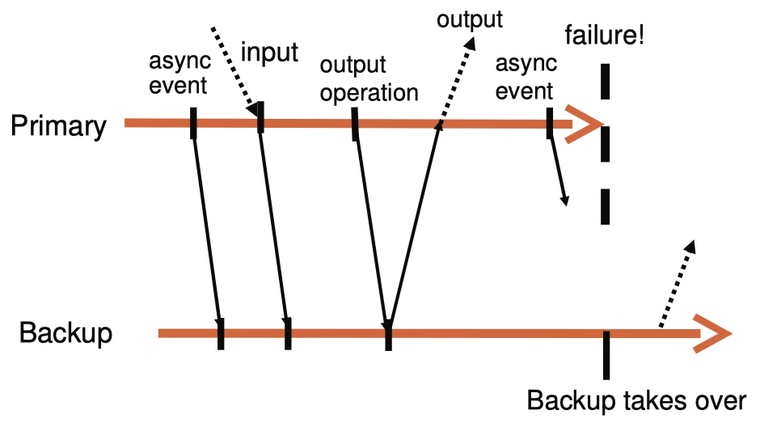
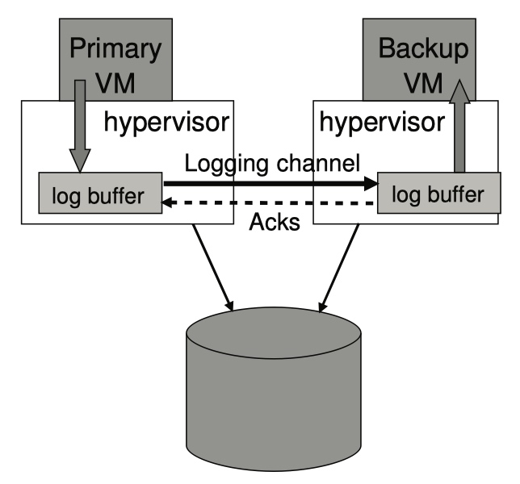

# 6.824 2018 Lecture 4 Primary-Backup Replication
# Readings - Practical System for Fault-Tolerant Virtual Machines Fault-Tolerant Virtual Machines论文
这篇论文讨论的主从复制与常见的相比，非常极端和雄心勃勃，论文基于vm构建了一个os级别的主从复制系统，较为细致的讨论了主从复制的设计和实现。

## 介绍
主从复制是实现server容错的常用方法，如果primary挂了，backup可以继续提供服务。将primary的全量数据同步到backup是比较耗费带宽的操作。更好的方法是将server视为确定状态机，基本思路是把primary和backup置为相同的初始状态，并保证二者都能以相同的顺序收到相同的输入。由于存在某些操作是非确定的（如：中断和获得当前时间），因此还需要额外的协同。

## FT协议
### Deterministic Replay
为了实现在backup进行replay，需要保证：
1. 正确的捕获所有输入和非确定的操作，以保证backup的确定性执行。
2. 在backup上正确的replay。
3. 对性能没有影响。

> 论文中关于非确定的操作，零零散散在不少地方提到，不过总结下来其实就是，这个操作不是pure function，结果受除输入的外部状态影响。更具体的就是，非确定操作使用到的资源是与其他（来自vm或hypervisor）的进程共享的，竞争导致了非确定的结果。
> 
> 在多核系统上，上述的竞争会更复杂，这也是为什么论文没有在多核系统上实现的原因。

### FT协议
primary的日志实时的通过logging channel发送到backup。为了保证在切换的时候，backup能够以与primary相同状态进行服务，需要满足：

**Output Requirement**：如果primary失败，backup接替了primary，backup的执行需要保证所有的输出都与primary的一致。

只要满足Output Requirement，在发生主从切换的时候，client就感知不到打断和不一致。为了保证Output Requirement，需要backup在收到能够产生那个output的input之前，primary推迟输出，也就是下面的规则：

**Output Rule**：只有当backup收到能够产生一个output的log，并返回ack（表示已经存入log buffer）给primary，primary才能输出。

> 除了VM-FT有，在其他的多副本系统上都以某种形式出现着。

primary等待ack不必阻塞系统当前的执行。

### 检测和响应失败
检测失败：
* server之间的heartbeat
* logging channel的traffic是否一直存在

如何避免split-brain：
* 共享磁盘存储，原子的检测标志位

## 实现
### FT VM启动
* 使用基于VMware VMotion实现的FT VMotion完成clone，primary的中断小于1s。
* 使用VMware vShpere实现的集群服务来选择最佳server创建backup。

### logging channel管理

**log buffer的局限：**
primary（或backup）的log buffer满了（或空了），primary（或backup）需要等待至log buffer可用为止，此时会暂停对client的服务。

主从切换的时间=检测primary失败的时间+backup消费log buffer的时间，为了减少切换的时间，在backup无法及时消费log的时候，会减慢primary的速度（限制CPU）。

### FT VM上的操作
除VMotion外的所有运维操作（例如：调整cpu限制），都必须在primary上完成，然后通过特殊的日志项目发送到backup。

### 关于磁盘io的实现问题
1. 磁盘访问时的竞争会导致非确定的操作。
    * 检测这样的io竞争，并在primary和backup上以相同顺序执行。
2. 使用DMA时，对磁盘和内存的访问会导致非确定的操作。
    * 对磁盘的读写，改为读写bounce buffer。
    * 只有当数据全部读到buffer以后，FT才会*从读指令处*恢复primary/backup的执行，避免二者出现差异（如果直接依赖DMA读取，primary和backup可能会在不可预知的时间点发生缺页中断，从而导致不一致）。
3. primary在磁盘io完成前就挂了。
    * backup切换为primary以后，无从得知io是否已经完成。FT会在backup上重试（前两点已经消除了导致非确定结果的操作）未完成的io操作。
    * 那么*如何判断未完成的io操作是哪些*？io完成以后，设备会产生一个中断，如果某个io log缺少相应的中断，那么就需要重试。
4. primary在磁盘io完成后挂了
    * backup同样无从得知io是否已经完成。此时重新执行写磁盘是幂等的（而对于网络io，tcp会忽略重复的包）。

### 关于网络io的实现问题
hypervisor对vm buffer的更新导致了非确定操作，改为由vm触发hypervisor的中断，并记录到log。

## 其他设计
### 非共享磁盘
优势：
* 磁盘作为vm的内部状态，primary写磁盘时不必等待backup的ack。

缺点：
* backup失败、执行FT VMotion时，需要同步磁盘数据。
* 需要使用其他方法来解决split-brain，例如：另外一个server作为共享存储；多个机器进行投票选主。

### backup上执行read
在从执行read，论文考虑的点并不是可以增加系统的read上限，而是考虑不发送read log可以减少logging channel的带宽。

具体看在backup上执行read，需要注意的点是：
* 如果primary成功，backup失败，backup需要重试，直到成功。
* 如果primary失败，那么尝试读取的内存必须发送到backup。
* 如果primary执行了读，然后是写，那么在backup也必须按照这个顺序来执行。

# Lecture
## Fault tolerance
**理想的特性**
* 可用性
* 强一致性
* 对client和server software透明
* 高效

**容错，容什么错？**
* Fail-stop failures
* Independent failures
* Network drops some/all packets
* Network partition

不包括：
* Incorrect execution
* Correlated failures
* Configuration errors
* Malice

## Fault tolerant MapReduce master
lab 1中的woker由于是无状态的，且mapper和reducer执行的都是pure function，因此实现容错很简单。

master实现容错，需要考虑：
* 需要复制什么状态？应用程序级？指令级？（woker list、完成的job、空闲的worker、tcp连接状态、程序memory和stack、cpu寄存器？）
* primary是否需要等待backup？
* 什么时候切换到backup？
* 切换时是否能被观察到？
* 如何快速的切换？

**主要方法有**
1. State transfer，简单，但是state可能会很大，传输很慢
    * 主副本执行服务
    * primary把新状态发送到backup
2. Replicated state machine，高效但复杂
    * 所有副本执行所有的操作
    * 如果所有副本有相同的起始状态、相同的操作、相同的顺序、deterministic，那么就会有相同的最终状态
    * 例如：VM-FT，GFS

## VM-FT
VM-FT是一个replicated state machine。

为了避免primary和backup出现差异，backup必须在指令流的相同位置、以相同的顺序看到相同事件。对于普通的指令，这个是比较容易实现的。FT对中断和磁盘/网络io会做特殊的处理。

例如：时钟中断

## FT的有缺点
**适用场景**
1. 重要且低延迟的服务，例如：name server。
2. 不便于修改的服务。

**不适用的情况**
1. 高吞吐量的服务
    * state仅仅是应用程序级别的，降低了开销，实现更高的性能。
    * 例如：GFS适用应用程序级别的state。

# Reference
1. [FAILURE MODES IN DISTRIBUTED SYSTEMS](http://alvaro-videla.com/2013/12/failure-modes-in-distributed-systems.html)