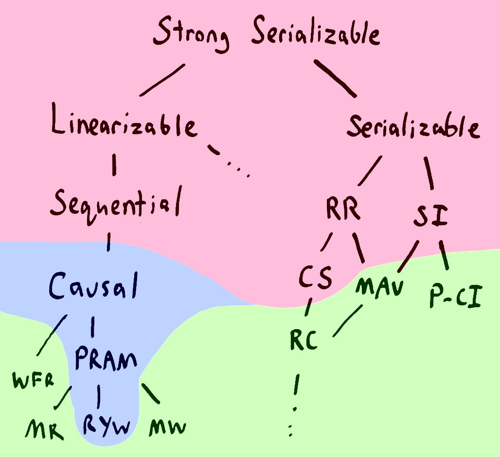

# 一致性？

# Reference
1. [被误用的“一致性”](http://blog.kongfy.com/2016/08/%E8%A2%AB%E8%AF%AF%E7%94%A8%E7%9A%84%E4%B8%80%E8%87%B4%E6%80%A7/)
2. [Strong consistency models](https://aphyr.com/posts/313-strong-consistency-models)
3. [Survey on Consistency Conditions](https://www.ics.forth.gr/tech-reports/2013/2013.TR439_Survey_on_Consistency_Conditions.pdf)
4. Linearizability: A Correctness Condition for Concurrent Objects
5. https://pingcap.com/blog-cn/linearizability/
6. https://zhuanlan.zhihu.com/p/43949695
7. http://duanple.blog.163.com/blog/static/7097176720185963122866/

* [memory ordering](http://gavinchou.github.io/summary/c++/memory-ordering/)
* [Memory Consistency Models: A Tutorial](https://homes.cs.washington.edu/~bornholt/post/memory-models.html)
* [Consistency Models](https://jepsen.io/consistency)
* [When I memcpy a struct into a std::atomic of that struct, why does the result not match?](https://blogs.msdn.microsoft.com/oldnewthing/20180328-00/?p=98365)
* [Understanding the C/C++ memory model](https://davmac.wordpress.com/2018/01/28/understanding-the-c-c-memory-model/)
* [Cache coherency primer](https://fgiesen.wordpress.com/2014/07/07/cache-coherency/)
* [高效内存无锁队列 Disruptor](http://shanshanpt.github.io/2016/11/01/disruptor.html)
* [分布式系统一致性 Linearizability vs. Sequential consistency](http://kaiyuan.me/2018/04/21/consistency-concept/)
* Time, Clocks, and the Ordering of Events in a Distributed System
* Sequential Consistency versus Linearizability
* http://cs.brown.edu/courses/cs176/
