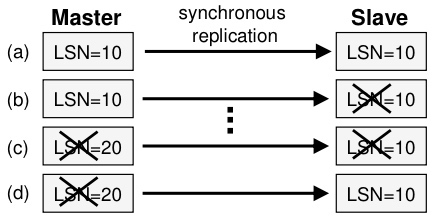
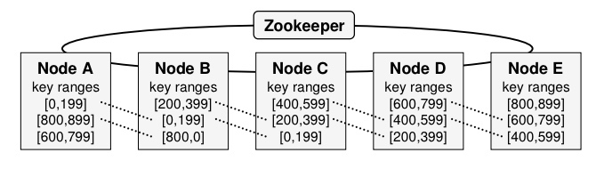

# 6.824 2018 Lecture 7 Spinnaker 2
# Readings - Using Paxos to Build a Scalable, Consistent, and Highly Available Datastore论文
## 介绍
很多应用有横向扩展的需求，这超出了商用数据库的处理能力。其中一个低成本的解决方案是基于hash或range进行分片，为了保证线性扩展能力，事务常常被限制在一个节点。机器多了以后，各种故障是不可避免的，为了保证可用性，需要容错机制。其中一个方式是主从复制。但主从复制并不能应对所有的故障。

例如：在slave挂了的情况下，master继续服务。接着如果master挂了，slave恢复，那么master的未同步到slave上的日志对外就不可见了。

3副本备份是一个更好的选择，同时也能便于在线升级，但3副本带来了更复杂的一致性问题。paxos协议可以用于解决这个问题，但paxos从未被用于数据存储系统。

spinnaker是linkedin开发的实验性质的数据存储系统，基于paxos进行日志提交和恢复，设计在单个数据中心使用，3副本数据备份，支持基于key的range partition，提供事务型的get-put api（可选强一致性或时间轴一致性）。不同于zk仅仅做为配置管理，spinnaker直接基于paxos实现了多副本数据备份。

## 数据模型和API
数据组织方式为，
* 数据以行和表的形式进行组织。
* 表中的每行用唯一的key来标识。
* 每行可以包含任意数量的列，其中包含相应的值和版本号。
* 列名和值对spinnaker是不透明的字节。

基本API包含，
* `get(key, colname, consistent)`
    `consistent`为true时，使用强一致性。
* `put(key, colname, colvalue)`
* `delete(key, colname)`
* `conditionalPut(key, colname, value, v)`
    occ，仅当当前版本号与`v`相等才put。
* `conditionalDelete(key, colname, v)`

**版本号**
版本号是单调递增的整型数，用于实现occ。

## 架构

**总体**，
* 使用range partition进行分片。
* 每个node分配一个基础key range，并复制到接下来的N - 1个节点上（例如：A的[0, 199]复制到B和C），默认N = 3。存储同一个key range副本的这N个节点叫做*cohort*。

**每个节点**，
* 使用一个共享的WAL。
* 每个log记录都通过一个LSN唯一标识。

**zk**，
* 用于容错和分布式协调。
* 集中存储元数据、管理事件（例如：节点失败），简化了spinnaker的设计。
* 读写并不经过zk，一般情况下，spinnaker节点与zk的通信只有heartbeat。

## 日志复制
日志复制是运行在每个cohort中的。每个cohort都有自己的leader，cohort中其余的server是follower，复制协议有两个阶段：*leader选举*和*quorum阶段*。quorum阶段是服务client的阶段。

### 复制
进入稳定状态的spinnaker，client提交write W后，
1. W始终会被路由到所属key range的leader。
2. leader生成一个W的log记录，并追加到log。
3. leader将log刷入磁盘。
    * 与此同时，leader append W到commit queue，并向follower发送propose消息。
4. follower收到propose消息后，也将log刷入磁盘，并append到commit queue，返回ack。
5. leader收到*至少一个*follower的ack后，apply W到memtable，返回client结果。

类似raft，leader还会周期性的发送异步commit message到follower，要求把截止到特定LSN的write日志apply到memtable。

对于读，
* 强一致性读*总会被路由到cohort的leader*，以保证能够看到最近写入的值。
* 时间轴一致性读*会被路由到cohort的任意节点*，因此直到提交的消息处理前，在可能会看到过期的值。提交的消息处理前的这段时间叫做commit period。

### 恢复

### timeline consistency

# Lecture
