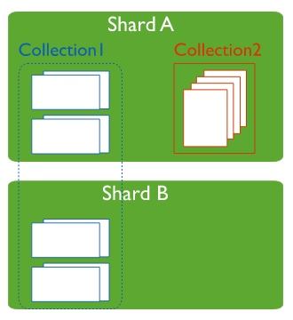
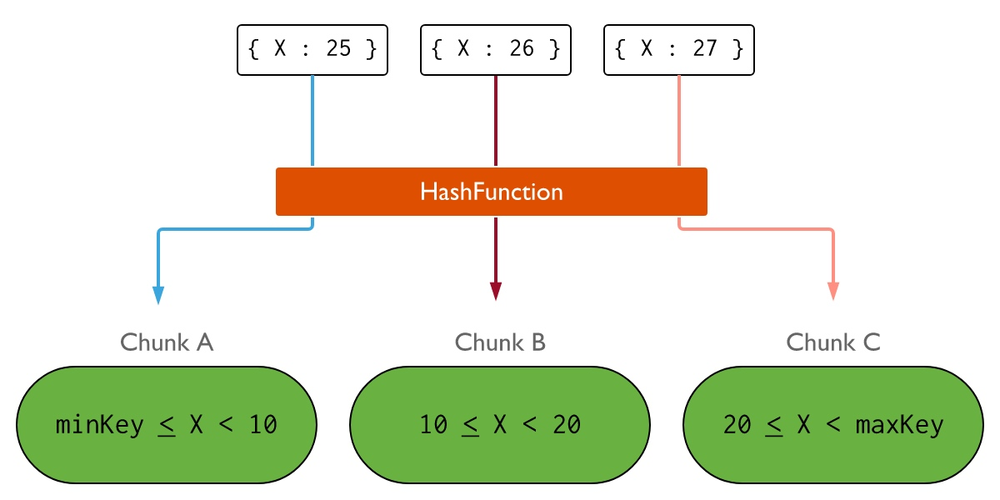

# mongodb分片
mongodb使用分片来支持大数据集和高吞吐量操作，分片是在collocation级别进行的，是一种用横向扩容来应对数据集和吞吐量增长的方式。

# shard cluster components
**shard**
每个shard包含了整个数据的子集，shard可以部署为一个副本集。所有shard一起承担了整个数据集的存储。

每个分片集群有一个主分片（primary shard），*保存了db中所有未分片的collocation*。mongos在创建db的时候，选择集群中数据量最少的分片来作为主分片。使用`movePrimary`命令可以迁移主分片，迁移需要花费大量的时间，直到完毕前，都不能访问db。

**config servers**
config servers存储集群的元数据和配置。这些元数据包括每个shard分片的chunk列表，以及定义chunk的range。mongo实例缓存这些数据用于路由读写操作到正确的chunk，同时当元数据变更的时候（例如：chunk分裂、增加一个shard）更新缓存。分片也会读取config servers的元数据。

**mongos**
mongos作为查询路由，提供了client和分片集群之间的接口。mongos通过缓存来自config servers的元数据来得知数据应该在哪个shard。

查询的路由过程如下，
1. 决定哪些shard需要收到查询。
2. 建立一个到所有目标shard的cursor。
3. 合并来自每个目标shard的数据，返回结果。
    特定的查询，例如排序，在返回到mongos前会在shard上先执行。

targeted operations和broadcast operation，
* targeted operation
    某些情况下，当查询的条件包含shard key或者compound shard key的前缀的时候，mongos会执行targeted operation，将查询路由到集群shard的子集。
    一般来说，分片环境下最快的查询是，路由到单个分片的查询。
* broadcast operation
    如果查询不包含shard key（有时包含shard key也会），mongos会执行broadcast operation，将查询路由到所有分片。mongos收到来自所有分片的响应后，合并并返回结果文档。

# shard key
shard key决定了文档在分片的分布情况。shard key是某个field的索引、或者组合field的索引。

mongodb使用shard key值的范围来对数据进行分区，每个range都定义了一个值不重复的shard key，并与一个chunk关联。mongodb会尝试均匀的把chunk分部到集群的分片上，shard key会有接影响到chunk的分布。

## shard key规范
可以使用`sh.shardCollection()`来对一个collocation进行分片。

要注意的是，
* 一旦对某个collocation进行了分片，所选择的shard key就是不可变的。
* 从mongodb4.2起，可以改变除`_id`外的shard key的值。

## 修改shard key的值
当修改shard key值的时候，
* 需要在mongos上，用事务或可重试写来完成。不能直接在分片上修改。
* 必须使用完成的shard key作为过滤条件（针对复合索引的情况）。

## shard key索引
所有分片collocation必须有一个支持shard key的索引，即索引是shard key，或者前缀是shard key。

如果collocation是空的，`sh.shardCollection()`会在这个shard key上建立索引。如果collocation不是空的，那么需要事先创建索引，然后调用`sh.shardCollection()`。

## 唯一索引

## shard key的选择
### shard key cardinality
shard key cardinality是shard key值的个数，决定了balancer可创建的最大chunk数，chunk数会影响集群的横向扩容的有效性。如果某个shard key cardinality是4，那么集群中只会有4个chunk，每个存储了唯一的shard key值，额外增加shard并不会有什么收益。

如果shard key的 cardinality比较低，可以考虑使用组合索引。

### shard key frequency
shard key的频次也会影响横向扩容是否有效。如果大量的文档都落在一个chunk内，那么这个chunk就会成为集群的瓶颈，这样的chunk可能会进一步增长，变为indivisible chunks（不能拆分）。可以考虑使用组合索引来解决这个问题。

### 单调变化的shard key
一个单调递增或递减的shard key更有可能集中在一个分片内部。因为每个chunk都定义了一个范围，而收尾两个chunk的lower bound和upper bound分别是minKey和maxKey，一直递增或者递减，那么后续所有的文档就会写入这两个chunk中。可以考虑使用hashed sharding来解决这个问题。

# shard strategy
## hashed sharding
hashed sharding使用hashed index对数据进行分区。

值相近的shard key不大可能会hash到同一个chunk中，基于hash的方式可以实现更均匀的数据的分布，尤其是针对shard key是单调递增的情况。但这使得range query需要使用broadcast operations。

## 对collocation进行分片
可以使用`sh.shardCollection( "database.collection", { <field> : "hashed" } )`来对分区进行分片。

**有数据的collocation**
* 分区操作创建了覆盖整个shard key范围的初始chunks。chunk的默认大小是64MB。
* 初始chunks创建以后，balancer会在shard之间迁移初始chunks。

**空的collocation**
* 对于没有zone和zone range的情况，
    * 分区操作创建空的chunks，这些chunks覆盖了shard key的取值范围，并进行一次初始的分发。默认情况下会每个shard会创建2个chunk。
    * 初始chunks创建以后，balancer会管理chunks的分布。

## ranged sharding
ranged sharding基于shard key将数据分到chunk中，每个chunk会基于shard key分配一个range。

值相近的shard key很可能会被放到同一个chunk中，这使得targeted operations可以路由到包含数据的chunk。

# zones
在做了分片的collocation中，一个范围内的shard key对应的文档的集合。