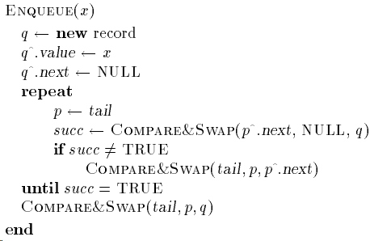
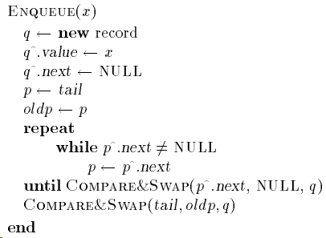
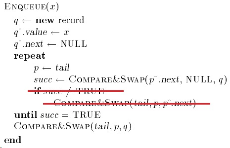
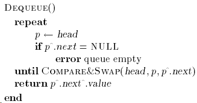
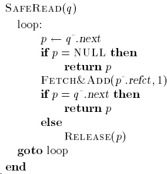

# Notes of Implementing Lock-Free Queues

# Linearizability

Linearizability implies that each operation appears to take place instantaneously at some point in time, and that **the relative order of non-concurrent operations** is perserved. In other words, for operations that are not concurrent, that data structure behaves exactly like its sequential counterpart.

# Linked List Implementation

Dummy node is used,

* 避免了队列为空或只有一个结点时带来的问题，
* 避免了只有一个结点时enqueue和dequeu之间的竞争。

## Enqueue

### Method 1

在首次CAS成功前，如果`tail`不指向队列的最后一个结点，则会修改`tail`指向它的后续结点。但是在有其他线程也在enqueue时，频繁的修改`tail`会带来较高的开销。

### Method 2

这里的tail只是一个hint，它指向的位置**不一定**是最后的一个结点。

如果某个线程在插入完成后，还未来得及修改`tail`，那么所有其他想要enqueue的线程就必须遍历到真正的tail。这样一来，用于遍历的时间就会大大增加。

### Method 3

这个方法及基于第一个方法的改进，效率是三个方法中最高的。

在去除`if`后，插入失败的enqueue就不必亲自更新`tail`，只需要等到那个插入成功的线程更新`tail`后，当前的enqueue就可以成功。

但是这个方法依赖于插入成功的线程更新`tail`，问题在于如果插入成功的线程还没来得及更新就挂了，那么其他所有的enqueue都会一直失败。这样一来，enqueue就不是non-blocking的了。

解决的方法是结合上面的第二个方法，加上重试次数，达到重试次数后，亲自去更新`tail`即可。

## Dequeue

Execpt the dummy node, nothing special here.

## ABA Problem

大多数使用CAS来实现lock-free的算法都必须要解决ABA问题。上面的算法也不例外，如果某个结点的内存区域被后续的操作重用，而保存了那个结点的操作还未完成CAS，那么当这个调用这个CAS的时候，地址是一样的，但实际上已经发生了其他操作。

Valois使用了引用计数来解决这个问题。

# Problem in Above Implementation

其实Valois用引用计数并未完全避免了ABA的发生。Michael在另一篇论文中指出了存在race condition。