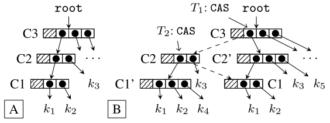

@(thought)[concurrency 并发, data structures and algorithms 数据结构和算法]

# Notes of Non-Blocking Snapshots Concurrent Tries

# Hash tries

Hash tries (Hash array mapped tries) are trees composed of internal nodes and leaves. Leaves store key-value bindings.

# Race



T1要插入k5到C2，与此同时T2要插入k4到C1。T1成功的进行了CAS，但是T2进行的CAS操作是在老的C2上，最后导致k4丢失。

这里的race类似于Non-blocking Binary Search Trees的情况，两个线程各自进行操作，就线程自己来看，所做的操作是正确的，但是相互不知道有race。

*这个结构能否使用Non-blocking Binary Search Trees的方法（mark和flag）？*

## 解决

引入各种中间结点。。。

# Snapshot

`size`、`iterator`和`clear`不能简单的以lock-free的方式来实现，因为需要某一时刻的全局信息。基于atomic snapshot，这些操作可以高效和正确的得到结果。

当一个snapshot被创建时，root I-node被复制，并被设置为新的generation。这个generation count可以由每个I-node保存。当某些update操作检测到它gen比root老，它就创建带有最新gen的那个I-node的copy，并根据需要update parent。snapshot创建后最终的效果就是，当首次访问（update）那个leaf的时候，从root到leaf，整个path都被update。

这里用到的snapshot方法，我觉得本质上还是copy on write。

## Race

创建snapshot的线程、读取了老的root且正在遍历并update的线程之间（插入操作的linearization point可能会先于snapshot的创建）。

## GCAS (generation-compare-and-swap)

直接用CAS在这里并不可行，因为有gen，就需要同时比较新老数据，还有I-node和root的gen。

GCAS类似CAS，不同的地方是加入了I-node和root结点gen的比较。

```scala
def GCAS(in, old, n)
	r = READ(in.main)
	if r = old && in.gen = READ(root).gen {
		WRITE(in.main. n)
		return true
	} else return false
```

具体的操作是先不管gen的情况，把old Main node挂到new Main node的prev上，接着把new Main node挂到I-node，最后处理I-node下Main node的情况。


*现在的问题是怎么update从root到leaf的path？*

当遍历时遇到一个I-node，如果gen < startgen，那么就创建它的C-node和这个C-node下面所有I-node的copy，这个C-node下面其他类型的node（S-node）不copy。这样就update了从root到leaf的path。

## RDCSS

*问题又来了，其他I-node可以被创建copy，但是第一个I-node，即root，它并没有在C-node下面，如何创建新gen的root？*

直接创建新gen root的copy，然后cas挂上去，这个方法并不好完成。因为只有当root和old I-node一致，且old I-node的main和old main一致（因为原文代码165行的地方，需要old main来构建新的I-node）时才行。

这里使用的RDCSS源自Harris提出的方法，类似GCAS。

```scala
def RDCSS(ov, ovmain, nv)
	r = READ(root)
	if r = ov && GCAS_READ(ov.main) = ovmain {
		WRITE(root, nv)
		return true
	} else return false
```

要注意的是：如果两个线程，一个GCAS对root I-node进行操作，另一个RDCSS对Ctrie的root成员进行操作，那么回导致死锁（**为什么？与RDCSS中**（*C2的if进行比较以后，会不会有其他thread改变o1？*）**这个问题有关？**)。

因此引入了ABORTABLE_READ。

### A detail in `RDCSS_Complete`

```scala
val oldmain = ov.gcasRead(this)
 if (oldmain eq exp) {
   if (CAS_ROOT(desc, nv)) {
     ...
```

> My previous doubt lies in line 711. The `oldmain` is compared with `expectedmain`. If they are reference to same main node, then do `CAS_ROOT`. Suppose thread A is executing `RDCSS_Complete` and just finished line 710. Thread B is inserting a key value pair at the mainnode of root. What if thread B changes the `MainNode` reference in the root into a new mainnode before thread A execute `CAS_ROOT`?

> The doubt is unnecessary. Since thread A is executing `RDCSS_Complete`, the root must be `RDCSS_Descriptor`. If Thread B want to insert at the `Mainode` of root, it will read root first, find it’s RDCSS_Descriptor and call `RDCSS_Complete` to help thread A first. So Thread B can’t change the `MainNode` reference in the root directly.

（与Aleksandar Prokopec邮件的内容，就是问题和自己的理解，这里只是做个整理，不翻译了，其实是懒。。。）

## Snapshot

```scala
def snapshot()
	r = RDCSS_READ()
	expmain = GCAS_READ(r)
	if RDCSS(r, expmain, new INode(expmain, new Gen))
		return new Ctrie {
			root = new INode(expmain, new Gen)
			readonly = false
		}
	else return snapshot()
```

`snapshot()`以后，实际上是产生了两个新的root I-node，其中一个替换Ctrie自己的root，另一个用于构成返回Ctrie，这个返回的Ctrie就是所需的snapshot。

从上面伪代码来看，可能会产生怀疑的是，`snapshot()`刚刚完成时，两个root I-node都是reference到同一个C-node。*如果某个线程更改了root下的C-node，那snapshot中root下的C-node也被改，snapshot还有什么意思？*

snapshot的中的东西不会被更改，具体的原因如下，注意看版本号，


换句话说，就是当没有update或access时，Ctrie和snapshot共享结点；但是如果Ctrie发生update或access，从root到访问位置的path就被copy和update了，snapshot里的不变。

```scala
def snapshot()
	r = RDCSS_READ()
	expmain = GCAS_READ(r)
	if RDCSS(r, expmain, new INode(expmain, new Gen))
		return new Ctrie {
			root = r
			readonly = true
		}
	else return snapshot()
```

由于当计算snapshot的size或进行iterate时，snapshot是不变的，因此update涉及到的node是不必要的开销，因此使用旧的root，且把readonly设为true来构造snapshot。

# References

1. Concurrent Tries with Efficient Non-Blocking Snapshots, Aleksandar Prokopec, Nathan G. Bronson, Phil Bagwell, Martin Odersky
2. Non-blocking Binary Search Trees, Faith Ellen, Panagiota Fatourou, Eric Ruppert, Franck van Breugel
3. A Practical Multi-Word Compare-and-Swap Operation, Timothy L. Harris, Keir Fraser, Ian A. Pratt